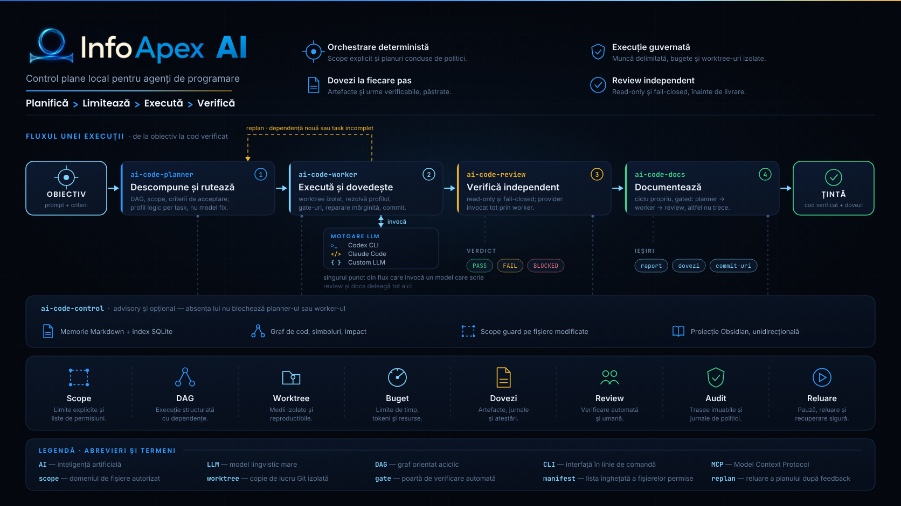
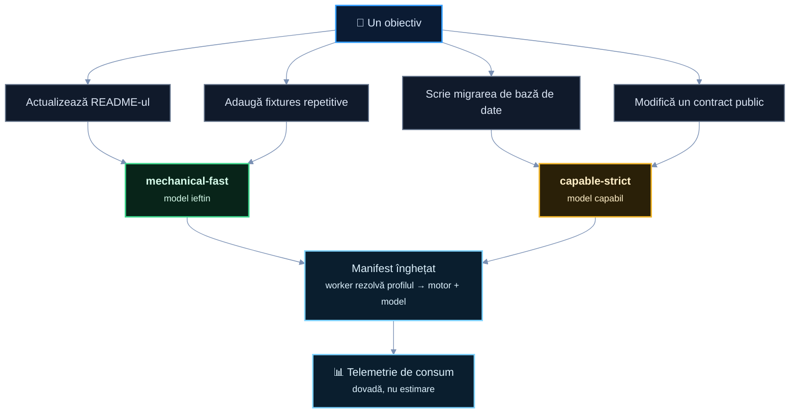
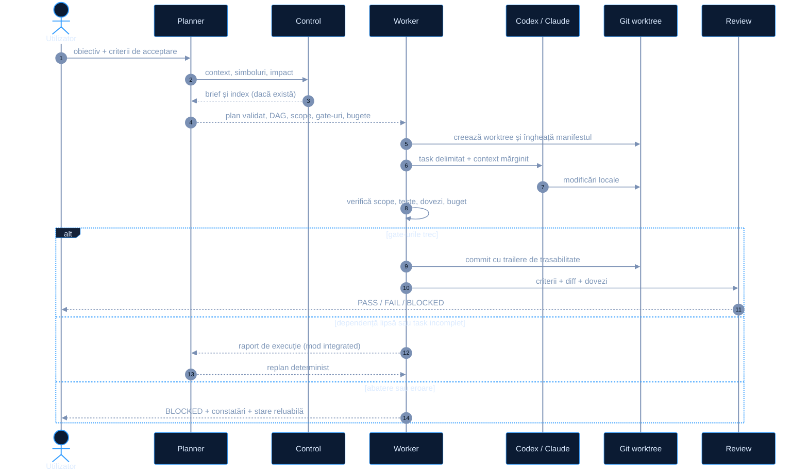
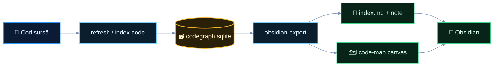

<p align="center">
  
</p>

<h1 align="center">Infoapex AI</h1>

<p align="center">
  <b>Un strat local de planificare, guvernanță și verificare<br>peste agenți de programare precum Codex CLI și Claude Code.</b>
</p>

<p align="center">
  <a href="https://github.com/Infoapex/infoapex-ai/actions/workflows/ci.yml"></a>
  
  
  
  
</p>

> [!IMPORTANT]
> **Stare: candidat implementat, pre-release.** Fluxurile deterministe interne sunt
> funcționale și testate. Rămân deschise gate-ul live cu consum real de provider și
> smoke test-ul bundle-ului ZIP. Vezi [Unde se află proiectul](#unde-se-află-proiectul).

---

## Ideea în trei propoziții

Un agent de programare este excelent la o conversație și o modificare punctuală.
Un flux autonom mai lung are nevoie de altceva: limite verificabile, ordine explicită,
bugete, dovezi și un verdict independent.

Infoapex AI nu este un model nou și nu înlocuiește Codex sau Claude. Este **procesul din
jurul inteligenței** — stratul care decide ce are voie agentul să facă, în ce ordine, cu
ce buget, și care păstrează probele.

## Ce rezolvă

Un flux autonom trebuie să răspundă determinist la întrebări la care istoricul unei
conversații nu poate răspunde:

| Întrebare | Unde trăiește răspunsul în Infoapex AI |
|---|---|
| Care este exact scopul aprobat? | plan validat prin JSON Schema |
| Ce fișiere pot fi atinse? | manifest autorizat, înghețat înainte de execuție |
| Ce task depinde de ce alt task? | DAG de execuție |
| Ce model merită folosit aici? | profil logic per task, rezolvat din politica locală |
| Cât are voie să consume? | bugete de timp, invocări, tokeni, cost |
| Ce face rezultatul acceptabil? | gate-uri cu dovezi păstrate |
| Cum reiau o execuție întreruptă? | stare reluabilă, în afara repository-ului țintă |
| Cum auditez intenția față de codul produs? | evenimente, manifeste, commit-uri, rapoarte |

## Cum funcționează

```mermaid
%%{init: {'theme':'base','themeVariables':{'fontFamily':'ui-sans-serif, system-ui, sans-serif','lineColor':'#7A90B4','primaryTextColor':'#7C93B5','edgeLabelBackground':'#152238','tertiaryTextColor':'#E8F2FF'}}}%%
flowchart LR
    O(["🎯 Obiectiv<br/><small>prompt + criterii</small>"]) --> P

    P["<b>ai-code-planner</b><br/>descompune și rutează<br/><small>DAG · scope · profil per task</small>"]
    W["<b>ai-code-worker</b><br/>execută și dovedește<br/><small>worktree · gate-uri · commit</small>"]
    R["<b>ai-code-review</b><br/>verifică independent<br/><small>read-only · fail-closed</small>"]
    D["<b>ai-code-docs</b><br/>documentează<br/><small>ciclu propriu, gated</small>"]
    T(["✅ Țintă<br/><small>cod verificat + dovezi</small>"])

    P --> W
    W -. "replan: dependență nouă<br/>sau task incomplet" .-> P
    W <==> E{{"🔌 Motoare LLM<br/>codex · claude · fake"}}
    W --> R
    R -- "PASS / FAIL / BLOCKED" --> D
    D --> T

    C["<b>ai-code-control</b> — advisory, opțional<br/><small>memorie · graf de cod · impact · scope guard</small>"]
    C -.-> P & W & R & D

    classDef start fill:#082032,stroke:#7FD3FF,stroke-width:2px,color:#DFF3FF
    classDef plan fill:#0B1B33,stroke:#2F9BFF,stroke-width:2px,color:#DCEBFF
    classDef work fill:#0A1E2E,stroke:#7FD3FF,stroke-width:2px,color:#DFF3FF
    classDef check fill:#2A2008,stroke:#F0B429,stroke-width:2px,color:#FFEFC8
    classDef done fill:#082419,stroke:#3DD68C,stroke-width:2px,color:#D6FBEA
    classDef engine fill:#141C2E,stroke:#94A3B8,stroke-width:2px,color:#E2E8F0
    classDef advisory fill:#0E1626,stroke:#4A6A99,stroke-width:1.5px,color:#B6C6DC

    class O start
    class P plan
    class W work
    class R check
    class D,T done
    class E engine
    class C advisory
```



Fluxul citește de la stânga la dreapta, dar trei detalii din diagramă sunt
intenționate și schimbă complet ce înseamnă proiectul.

## Cele trei reguli care fac diferența

### 1. Un singur punct de invocare a modelului

`ai-code-worker` este **singurul** component care poate invoca un provider care scrie.
`ai-code-review` și `ai-code-docs` deleagă acolo, chiar dacă au propriile lor cicluri.

Nu este un detaliu de implementare, este chiar mecanismul de guvernanță: dacă modelul
ar fi chemat din patru locuri, ai avea patru locuri de auditat, patru locuri unde
scope-ul poate scăpa și patru surse de adevăr pentru consum.

### 2. Planner-ul rutează logic, nu alege modelul

Planner-ul emite **profile logice** — `mechanical-fast-v1`, `balanced-default-v1`.
Worker-ul le rezolvă în motor și model concret din `.ai-code-worker/routing-policy.json`
și le îngheață în manifest.

Consecința: planul rămâne portabil. Identificatorii de model sunt politică locală, nu
conținut de business. Același plan rulează în alt repository, cu altă politică, fără
rescriere.

### 3. Review-ul nu repară

Providerul de review este read-only și **nu primește niciodată capacitate de reparare**.
Emite un verdict; remedierea este un ciclu nou, autorizat.

Repararea automată există, dar înăuntrul worker-ului, în cicluri mărginite, înainte de
review. Un verificator care își poate repara singur constatările nu mai este un
verificator.

## Economia de tokeni

O sesiune de agent obișnuită folosește același model scump și pentru un README, și
pentru o migrare de bază de date. Planner-ul alocă fiecărui subtask cel mai ieftin model
care îl poate rezolva corect și păstrează modelele capabile pentru contracte, migrări și
review.



Câștigul nu este „cheltuiește mai puțin". Este **să îți permiți modelul capabil exact
unde contează**, pentru că nu a fost ars pe fleacuri.

Ca afirmația să fie verificabilă, consumul este tratat ca dovadă, nu ca estimare:
câmpurile necunoscute rămân `null` și nu devin zero, iar fiecare raport primește un
verdict separat — `complete`, `partial` sau `unavailable`. Doar un raport complet poate
susține o comparație economică.

Distincția nu este teoretică: un PASS funcțional nu implică comparabilitate economică.
Codex, de exemplu, nu raportează în prezent costul în USD pentru conturi autentificate
prin abonament ChatGPT (confirmat direct: `rate_limits.credits` din rollout-ul local
arată `has_credits: false` — nu există un cont în dolari de raportat în acest mod de
facturare), deci consumul lui normalizat rămâne `partial` — suficient pentru a valida
execuția, insuficient pentru a susține o afirmație de cost.

## Anatomia unui task



Worker-ul păstrează starea **în afara** repository-ului țintă, produce evenimente și
rapoarte și poate relua fluxuri întrerupte.

Izolarea prin worktree, verificarea scope-ului și sandbox-ul motorului sunt straturi
diferite. Izolarea reală la nivel de sistem de operare depinde de backend-ul și
configurația folosite — vezi [Limite cunoscute](#limite-cunoscute).

## Modulele

Modulele nu își importă reciproc codul sursă. Comunică prin CLI, JSON, fișiere și
scheme versionate, ceea ce le face utilizabile și testabile independent.

| Modul | Ce face | Ce nu face |
|---|---|---|
| `infoapex-ai` | Bootstrap (`init`, `status`, `handoff`) plus CLI root unificat: `doctor` (agregă doctor-ul fiecărui modul), `plan`, `run`, `resume`, `review`, `docs` — toate deleagă la CLI-ul propriu, deja construit, al modulului corespunzător. | Nu importă cod sursă din module (deleagă mereu prin subproces); `status` rămâne separat de starea unui run (vezi `resume`). |
| `ai-code-planner` | Transformă un prompt în plan structurat, îl validează și îl lint-uiește, propune rutarea logică, îl compilează în formatul worker-ului. | Nu scrie cod. Nu produce manifestul final înghețat. Nu îți proiectează arhitectura. |
| `ai-code-worker` | Îngheață manifestul, construiește DAG-ul, rezolvă profilul logic, invocă motorul, aplică gate-uri, bugete și cicluri limitate de reparare, comite. | Nu importă cod de planner. Nu decide singur criteriile de acceptare. |
| `ai-code-review` | Orchestrare read-only pentru criterii și diferențe între commit-uri. `run` este fail-closed. | Nu scrie în repository-ul țintă. Nu primește capacitate de reparare. |
| `ai-code-docs` | Documentație prin ciclu propriu planner → worker → review. `generate` cade dacă oricare pas nu trece. | Nu invocă direct providerul; deleagă worker-ului. |
| `ai-code-control` | Memorie Markdown + index SQLite FTS, graf de cod, analiză de impact, scope guard, runner de validare, server MCP. | **Advisory și opțional** — absența lui reduce contextul, nu blochează un run. |

## Instalare

**Cerințe:** Node.js 22+, Git, .NET 9 SDK pentru `ai-code-control`, plus Codex CLI
și/sau Claude Code instalate și autentificate pentru execuții reale.

```bash
git clone https://github.com/Infoapex/infoapex-ai.git
cd infoapex-ai
npm run setup     # dependențele bundle-ului și ale modulelor vendorizate
npm run build
npm test
```

`npm run setup` nu descarcă module private la runtime. Versiunile standalone proiectate
în bundle sunt fixate prin commit complet în [`modules/provenance.json`](modules/provenance.json);
regulile de sincronizare sunt în [`docs/MODULE-PROVENANCE.md`](docs/MODULE-PROVENANCE.md).

## Pornire rapidă

**1. Inițializează bootstrap-ul în proiectul țintă**

```bash
npx --package . infoapex-ai init --repo /cale/catre/proiect --mode independent
npx --package . infoapex-ai status --repo /cale/catre/proiect
```

**2. Pregătește worker-ul și verifică mediul**

```bash
node modules/ai-code-worker/dist/src/cli.js init --repo /cale/catre/proiect --engines codex,claude
node modules/ai-code-worker/dist/src/cli.js doctor --repo /cale/catre/proiect --engine codex
```

**3. Propune, inspectează și compilează un plan**

```bash
node modules/ai-code-planner/dist/src/cli.js propose \
  "Implementează funcționalitatea X cu teste" \
  --repo /cale/catre/proiect --out draft.plan.json

node modules/ai-code-planner/dist/src/cli.js inspect draft.plan.json

node modules/ai-code-planner/dist/src/cli.js compile draft.plan.json \
  --task-id FEATURE-X --repo /cale/catre/proiect --out Plan/FEATURE-X.md
```

**4. Rulează planul**

```bash
node modules/ai-code-worker/dist/src/cli.js run \
  --repo /cale/catre/proiect --plan Plan/FEATURE-X.md \
  --engine codex --fallback-engine claude --json
```

> [!WARNING]
> Înainte de o execuție autonomă, verifică raportul `doctor`, configurația generată,
> permisiunile motorului și comenzile gate-urilor. Un plan acceptat poate determina
> executarea de procese locale în repository-ul țintă.

Începe cu `--engine fake`: este determinist, nu consumă provider și verifică tot
wiring-ul de orchestrare.

### CLI root unificat

Pașii 2-4 de mai sus pot fi rulați și prin CLI-ul root, care deleagă la CLI-ul propriu al
fiecărui modul ca subproces (niciodată prin import de cod sursă) și normalizează
rezultatul într-un envelope JSON comun (`schemaVersion`, `command`, `module`, `status`,
`exitCode`, `body`):

```bash
npx --package . infoapex-ai help   # listă completă de comenzi, usage și ce deleagă fiecare

npx --package . infoapex-ai doctor --repo /cale/catre/proiect --engine codex
npx --package . infoapex-ai plan "Implementează funcționalitatea X cu teste" --repo /cale/catre/proiect
npx --package . infoapex-ai run --repo /cale/catre/proiect --plan Plan/FEATURE-X.md --run-id FEATURE-X --engine codex
npx --package . infoapex-ai resume --repo /cale/catre/proiect --run-id FEATURE-X --plan Plan/FEATURE-X.md --engine codex
npx --package . infoapex-ai review --repo /cale/catre/proiect --request review-request.json
npx --package . infoapex-ai docs --repo /cale/catre/proiect --request docs-request.json
```

`doctor` este singura comandă agregată: rulează doctor-ul fiecărui modul prezent
(`ai-code-worker`, `ai-code-review`, `ai-code-docs`) și raportează starea cea mai proastă
dintre ele — un modul neinițializat sau lipsă blochează rezultatul agregat, nu e sărit
tacit. `resume` cere explicit `--run-id` și verifică întâi, prin `status`-ul propriu al
worker-ului, că acel run chiar există, înainte să delege la `run` — altfel respinge cu
`RUN_NOT_FOUND` în loc să pornească tacit un run nou sub acel id. Fiecare modul rămâne
complet utilizabil și testabil de sine stătător prin propriul CLI (comenzile de mai sus
sunt echivalente cu apelurile directe din pașii 2-4). Detalii complete: ADR
[`docs/adr/0003-unified-root-cli-delegation.md`](docs/adr/0003-unified-root-cli-delegation.md).

## Moduri de integrare

```text
infoapex-ai init --repo <cale> --mode independent   # implicit
infoapex-ai init --repo <cale> --mode integrated
```

În modul `independent`, modulele nu folosesc canalul comun și pot fi rulate separat.

Modul `integrated` activează `.infoapex-ai/runs/<runId>/`: planner-ul publică planul
acceptat și propunerea de rutare, worker-ul publică feedback-ul execuției, iar
planner-ul poate genera o continuare. Canalul este bazat pe fișiere și versionat. **Nu
este o dependență de runtime și nu creează apeluri circulare** — worker-ul poate rula
direct cu un plan, iar planner-ul poate genera planuri fără worker.

## Code map pentru Obsidian

`ai-code-control` poate proiecta graful SQLite într-un vault Markdown compatibil cu
Obsidian. Exportul este opțional și read-only față de cod.

```bash
dotnet run --project tools/ai-code-control/src/AiCodeControl.Cli -- refresh --full
dotnet run --project tools/ai-code-control/src/AiCodeControl.Cli -- obsidian-export
```



Fluxul este o proiecție **unidirecțională**: modificările din Obsidian nu sunt aplicate
în cod. Output-ul implicit este `docs/code-map/generated/` și este ignorat de Git.
Ghidul complet: [docs/OBSIDIAN-CODE-MAP.md](docs/OBSIDIAN-CODE-MAP.md).

## Verificare și porți de release

```bash
npm test
npm run check:generic-boundary
npm run value-gate:internal        # matrice ICM: 20 taskuri generice, motor fake
npm run pilot:icm-graph:internal   # + ingest, 25 query-uri hibride, drift, Obsidian
npm run review-gate:internal
npm run docs-gate:internal
npm run p2:preflight               # preflight P2-A pe fixture
```

Toate cele de mai sus sunt **deterministe și nu consumă provider**.
`npm run value-gate:live` și `npm run p2:preflight:live` consumă quota contului și
trebuie pornite explicit.

## Unde se află proiectul

| Etapă | Conținut | Stare |
|:--|:--|:--|
| **P0** | Integrare și publicare ICM + Graph în modulele canonice | ✅ închis |
| **P1** | Telemetrie de consum completă și comparabilă | ✅ implementat, sincronizat prin provenance |
| **P2** | Gate-uri live și comparație controlată | ✅ închis — P2-A + P2-B PASS funcțional, tokeni compleți pe ambele motoare, verdict economic **comparable** (procent din cota de 5 ore, nu cost USD — vezi mai jos) |
| **P3** | Bundle ZIP, clean install, release privat | ✅ închis — smoke test complet dintr-un ZIP curat (10/10 pași), CI matrice Windows + Linux verde, `v0.1.0` publicat ca GitHub Release privat |
| **P4** | CLI root unificat | ✅ închis — ADR-0003, registry, mecanism de delegare, comenzile `doctor`/`plan`/`run`/`resume`/`review`/`docs`, `infoapex-ai help` și testele lor sunt gata; fiecare modul rămâne complet utilizabil de sine stătător (niciun modul nu a fost modificat pentru delegare) |
| **P5** | SDK-uri și operare avansată | ⚪ post-stabilizare |

De ce `0.1.0` este pre-release și nu producție:

- gate-ul intern generic trece, dar nu măsoară încă valoarea comparativă față de
  folosirea directă a agentului;
- gate-urile live P2-A (2 invocări) și P2-B (10 task-uri reale, secvențial, 5 Codex + 5
  Claude) au trecut funcțional 10/10, cu tokeni compleți pe ambele motoare — vezi
  `validation/p2-b/LIVE-REPORT.md`. Decizie 2026-09-02: costul real, pentru abonamente
  fixe de 20$/lună (nu facturare per-token), e cât din **fereastra de 5 ore** a fost
  consumată, nu `costUsd` — care pentru Codex nici nu există structural pe acest tip de
  cont (confirmat: `rate_limits.credits` arată `has_credits: false`). Ambele motoare au
  acum acest procent cunoscut (Codex — măsurat direct din CLI; Claude — estimat din
  tokeni reali printr-o rată calibrată), deci verdictul economic combinat e
  **`comparable`**, nu `inconclusive`;
- invocarea Codex necesită încă `--codex-sandbox danger-full-access` explicit;
  invocarea implicită `workspace-write` e blocată de politica locală de aprobare;
- smoke test-ul complet dintr-un ZIP construit cu `git archive` (deci fără posibilitate
  de contaminare cu fișiere locale necomise) trece integral — extragere, `setup`/
  `build`/`test` de la zero, toate cele 4 gate-uri interne (planner, worker, review,
  docs, control) și instalatorul root în ambele moduri (`npm run release:smoke-test`);
  CI Windows/Linux e verde, iar `v0.1.0` e publicat ca GitHub Release privat.

Detalii și dovezi: [`docs/RELEASE-GATES.md`](docs/RELEASE-GATES.md),
[`docs/plans/INFOAPEX-AI-ROADMAP-P0-P5.md`](docs/plans/INFOAPEX-AI-ROADMAP-P0-P5.md),
[`validation/`](validation/).

## Comparat cu un agent folosit direct

| Aspect | LLM/chat simplu | Codex/Claude CLI | Extensie IDE | Infoapex AI + agenți |
|---|---|---|---|---|
| Generare și raționament | Da | Da | Da | Folosește motoarele existente |
| Experiență interactivă | Bună | Foarte bună | Cea mai bună în editor | Mai mult setup și structură |
| Context din repository | Limitat | Nativ | Nativ + vizual | Index, memorie și brief explicit |
| Plan executabil și versionat | De regulă nu | Depinde de sesiune | Depinde de sesiune | Da, cu scheme și lint |
| Scope autorizat verificabil | Nu | Permisiuni ale agentului | Permisiuni ale agentului | Manifest + verificare post-execuție |
| DAG și execuție multi-task | Nu | Agentic, în sesiune | Agentic, în sesiune | Explicit și reluabil |
| Rutare între furnizori | Nu | Nu în aceeași execuție | Nu în aceeași execuție | Codex/Claude + fallback controlat |
| Bugete și cicluri limitate | Foarte puțin | Configurație de sesiune | Configurație de sesiune | Politici explicite în plan |
| Dovezi și audit | Istoric conversație | Loguri de sesiune | Istoric + diff | Evenimente, manifeste, gate-uri, rapoarte |
| Cost operațional | Mic | Mic | Mic | Mai mare; justificat pentru fluxuri complexe |

[Codex CLI](https://learn.chatgpt.com/docs/codex/cli) și
[Claude Code](https://code.claude.com/docs/en/how-claude-code-works) au propriile lor
bucle agentice și acces la proiect și terminal, iar
[integrările](https://code.claude.com/docs/en/ide-integrations)
[IDE](https://learn.chatgpt.com/docs/codex/ide) adaugă diff-uri inline și control de
permisiuni.

**Folosește direct CLI-ul sau extensia** pentru explorare, depanare și schimbări mici.
**Infoapex AI devine util** când ai task-uri dependente, reguli stricte de scope, bugete,
handoff între agenți, cerințe de audit sau nevoia de a reproduce procesul într-o echipă.

## Limite cunoscute

- Nu înlocuiește Codex, Claude sau alt motor de raționament.
- Nu garantează calitatea unei cerințe ambigue; criteriile de acceptare rămân esențiale.
- Motorul `fake` verifică wiring-ul de orchestrare, nu calitatea unui provider real.
- Worktree-urile și verificarea scope-ului **nu echivalează singure cu un sandbox de
  sistem de operare**.
- Configurarea greșită a comenzilor de validare poate executa procese locale nedorite.
- CLI-ul root deleagă la modulele deja construite (nu importă cod sursă), dar nu
  re-validează contractele lor — o comandă malformată e respinsă de modulul țintă, nu
  de root.
- Integrarea live, securizarea distribuției și măsurarea A/B față de agenții direcți
  necesită validare suplimentară înaintea unui release de producție.

## Direcții de dezvoltare

- backend real de izolare la nivel de sistem/VM/container, cu capabilități probate;
- validarea strictă a fiecărui mesaj la toate granițele dintre procese;
- teste Windows și Linux, smoke test automat al bundle-ului ZIP, artefacte semnate;
- benchmark A/B pe aceleași task-uri: direct Codex/Claude versus flux orchestrat;
- adaptoare pentru motoare suplimentare fără a cupla contractele de un provider;
- UI local pentru DAG, bugete, evenimente, dovezi și aprobări umane;
- politici de echipă și aprobări explicite înaintea execuțiilor cu privilegii ridicate.

## Structura repository-ului

```text
infoapex-ai/
├── src/                         # CLI-ul root: init, status, handoff, doctor, plan, run, resume, review, docs
├── schemas/                     # contractele root de integrare
├── modules/
│   ├── ai-code-planner/         # plan, lint, rutare logică
│   ├── ai-code-worker/          # execuție, gate-uri, dovezi, commit
│   ├── ai-code-review/          # review independent, read-only
│   ├── ai-code-docs/            # documentație prin ciclu gated
│   └── ai-code-control/         # memorie, graf de cod, scope guard, MCP
├── scripts/
│   ├── *.mjs                    # setup, build și gate-uri integrate
│   └── splash/                  # generator design-time pentru assets
├── validation/                  # probe și rezultate de validare
├── docs/
│   ├── assets/                  # infografic, logo și sursele lor
│   ├── adr/                     # decizii de arhitectură
│   ├── plans/                   # roadmap P0–P5
│   └── ...                      # arhitectură, CI, release gates
└── tests/                       # testele bundle-ului root
```

## Identitate vizuală

Infograficul de mai sus și assets-urile de logo sunt în [`docs/assets/`](docs/assets/),
cu [nota lor tehnică](docs/assets/README.md). Se regenerează cu:

```bash
npm run generate:splash
```

Generatorul este **doar design-time** — nimic din bundle-ul livrat nu depinde de el.
Textul din SVG este convertit în contururi, deci imaginile nu depind de fonturi
instalate; Chromium și Edge le randează identic, iar PNG-urile sunt rasterizate din
exact aceleași SVG-uri.

## Securitate și contribuții

Nu introduce în planuri, rapoarte, fixture-uri sau memoria indexată secrete, token-uri,
credențiale, date personale ori conversații brute.

Rulează mai întâi motorul `fake`, inspectează planul și folosește cel mai restrictiv
profil compatibil cu task-ul.

Orice contribuție ar trebui să păstreze compatibilitatea contractelor sau să introducă o
versiune nouă de schemă, să adauge teste negative și să actualizeze documentația și
porțile de release.

## Licență

Proiect proprietar. Verifică termenii de distribuție ai proprietarului și fișierele
`LICENSE` ale modulelor înainte de redistribuire.
