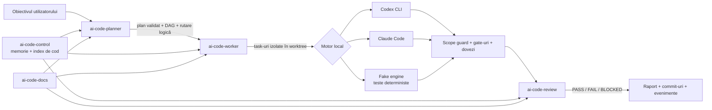
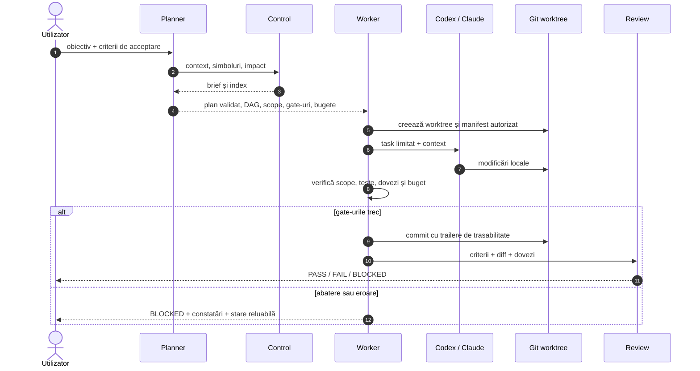
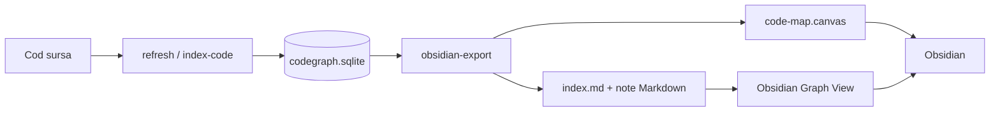

# Infoapex AI

**Un strat local de planificare, guvernanță și verificare pentru agenți de programare precum Codex CLI și Claude Code.**

[](https://github.com/Infoapex/infoapex-ai/actions/workflows/ci.yml)

> Stare: **candidat implementat / pre-release**. Fluxurile deterministe interne sunt funcționale și testate. Validarea live completă cu toți furnizorii și testul final al pachetului ZIP sunt încă porți de release deschise.

## Ce este proiectul

Infoapex AI nu este un model lingvistic nou și nici un înlocuitor pentru Codex sau Claude. Este un **control plane local** construit deasupra agenților existenți. El transformă o cerere în planuri și task-uri verificabile, limitează domeniul modificărilor, coordonează execuția, păstrează dovezi și cere review înainte de a declara lucrul terminat.

Ideea centrală este separarea responsabilităților:

- modelul/agentul propune sau scrie cod;
- Infoapex AI definește ce are voie să facă, în ce ordine și cu ce buget;
- Git, worktree-urile, schemele JSON și gate-urile oferă limite și probe reproductibile;
- memoria proiectului rămâne în Markdown versionat, iar indexurile SQLite sunt cache-uri reconstruibile.

Proiectul este local-first. Codex CLI și Claude Code rămân instalări locale separate; acest repository nu stochează credențialele furnizorilor.

## Problema rezolvată

Un agent de programare direct este foarte bun pentru o conversație și o modificare punctuală, dar un flux autonom mai lung are nevoie și de răspunsuri deterministe la întrebări precum:

- Care este exact scopul aprobat?
- Ce fișiere și simboluri pot fi atinse?
- Ce task depinde de ce alt task?
- Ce motor și ce profil sunt potrivite pentru fiecare task?
- Ce buget de timp, invocări și tokeni este permis?
- Ce teste și ce dovezi fac rezultatul acceptabil?
- Cum poate fi reluată în siguranță o execuție întreruptă?
- Cum este auditată diferența dintre intenție, codul produs și verdictul final?

Infoapex AI codifică aceste întrebări în contracte, manifeste și stări verificabile, în loc să le lase doar în istoricul conversației.

## Arhitectură



Modulele nu își importă reciproc codul sursă. Ele comunică prin CLI, JSON, fișiere și scheme versionate, ceea ce permite folosirea și testarea lor independentă.

| Modul | Rol real |
|---|---|
| `infoapex-ai` | Bootstrap minim pentru modul independent/integrat, stare și handoff-uri. În versiunea curentă nu este încă o interfață unică pentru toate comenzile. |
| `ai-code-planner` | Transformă un prompt într-un plan structurat, îl validează, îl lint-uiește, propune rutarea logică și îl compilează în formatul worker-ului. Nu implementează singur codul. |
| `ai-code-worker` | Îngheață manifestul autorizat, construiește DAG-ul, rulează task-urile prin motoarele `codex`, `claude` sau `fake`, aplică gate-uri, bugete, review și cicluri limitate de reparare. |
| `ai-code-review` | Orchestrare read-only pentru verificarea criteriilor și a diferențelor dintre commit-uri. |
| `ai-code-docs` | Orchestrare pentru documentație generată prin planner, worker și review. |
| `ai-code-control` | CLI și server MCP în .NET pentru memorie, căutare full-text, indexarea simbolurilor, analiza impactului și controlul scope-ului. |

## Fluxul unei execuții



Worker-ul păstrează starea în afara repository-ului țintă, produce evenimente și rapoarte și poate relua fluxuri întrerupte. Izolarea prin worktree, verificarea scope-ului și sandbox-ul motorului sunt straturi diferite; izolarea reală la nivel de sistem de operare depinde de backend-ul și configurația folosite.

## Capabilități principale

- planuri structurate și validate prin JSON Schema;
- DAG de task-uri și paralelism controlat;
- scope explicit, manifest autorizat și detecția fișierelor modificate în afara lui;
- worktree separat pentru fiecare task de scriere;
- rutare logică spre Codex sau Claude și fallback pentru erori eligibile;
- limite de timp, invocări, tokeni, cost estimat și cicluri de reparare;
- gate-uri globale și pe task, cu dovezi păstrate în raport;
- review independent și verificarea criteriilor de acceptare;
- jurnal de evenimente, recuperare după întrerupere și export de handoff redactat;
- memorie Markdown versionată plus index SQLite reconstruibil;
- analiză de simboluri și impact tranzitiv pentru C#, TypeScript/JavaScript și SQL;
- motor `fake` pentru teste deterministe fără consum de provider.

## Code map pentru Obsidian

`ai-code-control` poate proiecta graful SQLite într-un vault Markdown compatibil cu Obsidian. Exportul este opțional și read-only față de cod: indexul SQLite rămâne reconstruibil, iar sursa de adevăr rămâne codul și documentația versionată.

```bash
dotnet run --project tools/ai-code-control/src/AiCodeControl.Cli -- refresh --full
dotnet run --project tools/ai-code-control/src/AiCodeControl.Cli -- obsidian-export
```

Output-ul implicit este `docs/code-map/generated/` și este ignorat de Git. Pentru un scope sau vault extern:

```bash
dotnet run --project tools/ai-code-control/src/AiCodeControl.Cli -- obsidian-export \
  --path modules/ai-code-worker \
  --out C:/vaults/infoapex-code-map \
  --include-symbols \
  --max-symbols 250
```

Exporterul produce `index.md`, note de module/fișier, note de simbol selectabile și `canvases/code-map.canvas`. Proprietățile YAML păstrează commitul indexat, branch-ul, hash-ul sursei și momentul generării. Ghidul complet este în [docs/OBSIDIAN-CODE-MAP.md](docs/OBSIDIAN-CODE-MAP.md).

Fluxul exportului este o proiectie unidirectionala din cod si indexul SQLite spre vault-ul Obsidian; modificarile din Obsidian nu sunt aplicate automat in cod:



## Moduri de integrare

```text
infoapex-ai init --repo <cale> --mode independent
infoapex-ai init --repo <cale> --mode integrated
```

`independent` este modul implicit. Planner-ul, worker-ul și celelalte module pot fi folosite separat.

`integrated` activează canalul comun `.infoapex-ai/runs`: planner-ul poate publica planul acceptat și propunerea de rutare, worker-ul poate publica feedback-ul execuției, iar planner-ul poate genera o continuare. Canalul este bazat pe fișiere și nu transformă modulele într-un monolit.

## Cerințe

- Node.js 22 sau mai nou;
- Git;
- .NET 9 SDK pentru `ai-code-control` și serverul său MCP;
- Codex CLI și/sau Claude Code instalat și autentificat pentru execuții reale;
- un repository Git țintă curat și o politică de permisiuni aleasă conștient.

## Instalare pentru dezvoltare

```bash
git clone https://github.com/Infoapex/infoapex-ai.git
cd infoapex-ai
npm run setup
npm run build
npm test
```

`npm run setup` instalează dependențele bundle-ului și ale modulelor vendorizate. Nu descarcă module private la runtime.

## Pornire rapidă

Inițializează bootstrap-ul Infoapex AI în proiectul țintă:

```bash
npx --package . infoapex-ai init --repo /cale/catre/proiect --mode independent
npx --package . infoapex-ai status --repo /cale/catre/proiect
```

Inițializează worker-ul și verifică mediul:

```bash
node modules/ai-code-worker/dist/src/cli.js init \
  --repo /cale/catre/proiect \
  --engines codex,claude

node modules/ai-code-worker/dist/src/cli.js doctor \
  --repo /cale/catre/proiect \
  --engine codex
```

Propune, inspectează și compilează un plan:

```bash
node modules/ai-code-planner/dist/src/cli.js propose \
  "Implementează funcționalitatea X cu teste" \
  --repo /cale/catre/proiect \
  --out draft.plan.json

node modules/ai-code-planner/dist/src/cli.js inspect draft.plan.json

node modules/ai-code-planner/dist/src/cli.js compile draft.plan.json \
  --task-id FEATURE-X \
  --repo /cale/catre/proiect \
  --out Plan/FEATURE-X.md
```

Rulează planul cu un motor real:

```bash
node modules/ai-code-worker/dist/src/cli.js run \
  --repo /cale/catre/proiect \
  --plan Plan/FEATURE-X.md \
  --engine codex \
  --fallback-engine claude \
  --json
```

Înainte de o execuție autonomă, verifică raportul `doctor`, configurația generată, permisiunile motorului și comenzile gate-urilor. Un plan acceptat poate determina executarea de procese locale în repository-ul țintă.

## Verificare și porți de release

```bash
npm test
npm run check:generic-boundary
npm run value-gate:internal
npm run review-gate:internal
npm run docs-gate:internal
```

`value-gate:internal` rulează trei fluxuri generice planner → worker cu motorul `fake`, fără consum de provider. `value-gate:live` folosește Claude instalat local, consumă quota contului și trebuie pornit numai explicit.

Starea corectă a versiunii `0.1.0` este pre-release deoarece:

- gate-ul intern generic trece, dar nu măsoară încă valoarea comparativă față de folosirea directă a agentului;
- execuția live Codex a fost validată într-un task controlat;
- gate-ul live complet cu Claude este încă blocat de execuția externă/quota disponibilă;
- publicarea primului bundle cere încă un smoke test dintr-un ZIP extras într-un proiect curat.

## Infoapex AI comparat cu un agent folosit direct

| Aspect | LLM/chat simplu | Codex/Claude CLI | Extensie IDE Codex/Claude | Infoapex AI + agenți |
|---|---|---|---|---|
| Generare și raționament | Da | Da | Da | Folosește motoarele existente |
| Experiență interactivă rapidă | Bună | Foarte bună | Cea mai bună în editor | Mai mult setup și structură |
| Context din repository | Limitat/manual | Nativ | Nativ + context vizual | Index, memorie și brief explicit |
| Plan executabil și versionat | De regulă nu | Depinde de sesiune | Depinde de sesiune | Da, cu scheme și lint |
| Scope autorizat verificabil | Nu | Permisiuni ale agentului | Permisiuni ale agentului | Manifest, fișiere permise și verificare post-execuție |
| DAG și execuție multi-task | Nu | Agentic, în sesiune | Agentic, în sesiune | Explicit și reluabil |
| Rutare între furnizori | Nu | Nu în aceeași execuție | Nu în aceeași execuție | Codex/Claude + fallback controlat |
| Bugete și cicluri limitate | Foarte puțin | Configurație de sesiune | Configurație de sesiune | Politici explicite în plan |
| Dovezi și audit | Istoric conversație | Loguri de sesiune | Istoric + diff | Evenimente, manifeste, gate-uri, commit-uri și rapoarte |
| Cost operațional | Mic | Mic | Mic | Mai mare; justificat pentru fluxuri complexe sau reglementate |

[Codex CLI](https://learn.chatgpt.com/docs/codex/cli) inspectează repository-ul, editează fișiere și rulează comenzi din terminal, iar [extensia Codex pentru IDE](https://learn.chatgpt.com/docs/codex/ide) adaugă contextul editorului și review-ul vizual al modificărilor. În mod similar, [Claude Code](https://code.claude.com/docs/en/how-claude-code-works) are propriul loop agentic și acces la proiect și terminal, iar [integrările sale IDE](https://code.claude.com/docs/en/ide-integrations) oferă diff-uri inline și controlul permisiunilor.

Prin urmare, avantajul Infoapex AI nu este „mai multă inteligență”. Avantajul este **procesul din jurul inteligenței**: aceeași cerere poate fi transformată într-un flux controlat, verificabil, reluabil și mai puțin dependent de un singur provider sau de memoria unei sesiuni.

Folosește direct CLI-ul sau extensia IDE pentru explorare, depanare și schimbări mici. Infoapex AI devine util când ai mai multe task-uri dependente, reguli stricte de scope, bugete, handoff între agenți, cerințe de audit sau nevoia de a reproduce procesul într-o echipă.

## Limite cunoscute

- Nu înlocuiește Codex, Claude sau un alt motor de raționament.
- Nu garantează calitatea unei cerințe ambigue; criteriile de acceptare rămân esențiale.
- Motorul `fake` verifică orchestration wiring, nu calitatea unui provider real.
- Worktree-urile și verificarea scope-ului nu echivalează singure cu un sandbox de sistem de operare.
- Configurarea greșită a comenzilor de validare poate executa procese locale nedorite.
- Interfața root `infoapex-ai` este în prezent un bootstrap subțire, nu încă un CLI unificat.
- Integrarea live, securizarea distribuției și măsurarea A/B față de agenții direcți necesită validare suplimentară înaintea unui release de producție.

## Direcții de dezvoltare

- CLI unificat pentru `plan`, `run`, `review`, `docs`, `status` și `resume`;
- backend real de izolare la nivel de sistem/VM/container, cu capabilități probate, nu doar declarate;
- validarea strictă a fiecărui mesaj la toate granițele dintre procese;
- teste Windows și Linux, smoke test automat al bundle-ului ZIP și artefacte semnate;
- benchmark A/B pe aceleași task-uri: direct Codex/Claude versus flux orchestrat;
- adaptoare pentru motoare suplimentare fără a cupla contractele de un provider;
- UI local pentru DAG, bugete, evenimente, dovezi și aprobări umane;
- politici de echipă și aprobări explicite înaintea execuțiilor cu privilegii ridicate.

## Structura repository-ului

```text
infoapex-ai/
├── src/                         # CLI-ul root infoapex-ai
├── schemas/                     # contractele root de integrare
├── modules/
│   ├── ai-code-planner/
│   ├── ai-code-worker/
│   ├── ai-code-review/
│   ├── ai-code-docs/
│   └── ai-code-control/
├── scripts/                     # setup, build și gate-uri integrate
├── validation/                  # probe și rezultate de validare live/internă
├── docs/                        # distribuție, CI și release gates
└── tests/                       # testele bundle-ului root
```

## Securitate și contribuții

Nu introduce în planuri, rapoarte, fixture-uri sau memoria indexată secrete, token-uri, credențiale, date personale ori conversații brute. Rulează mai întâi motorul `fake`, inspectează planul și folosește cel mai restrictiv profil compatibil cu task-ul.

Orice contribuție ar trebui să păstreze compatibilitatea contractelor sau să introducă o versiune nouă de schemă, să adauge teste negative și să actualizeze documentația și porțile de release.

## Licență

Proiect proprietar. Verifică termenii de distribuție ai proprietarului și fișierele `LICENSE` ale modulelor înainte de redistribuire.
