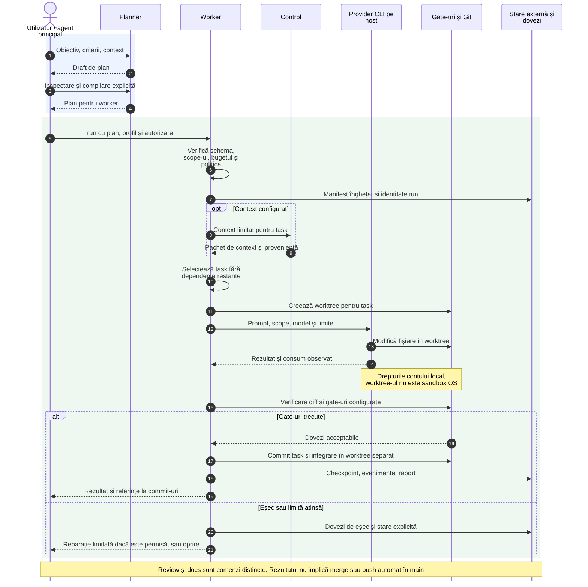
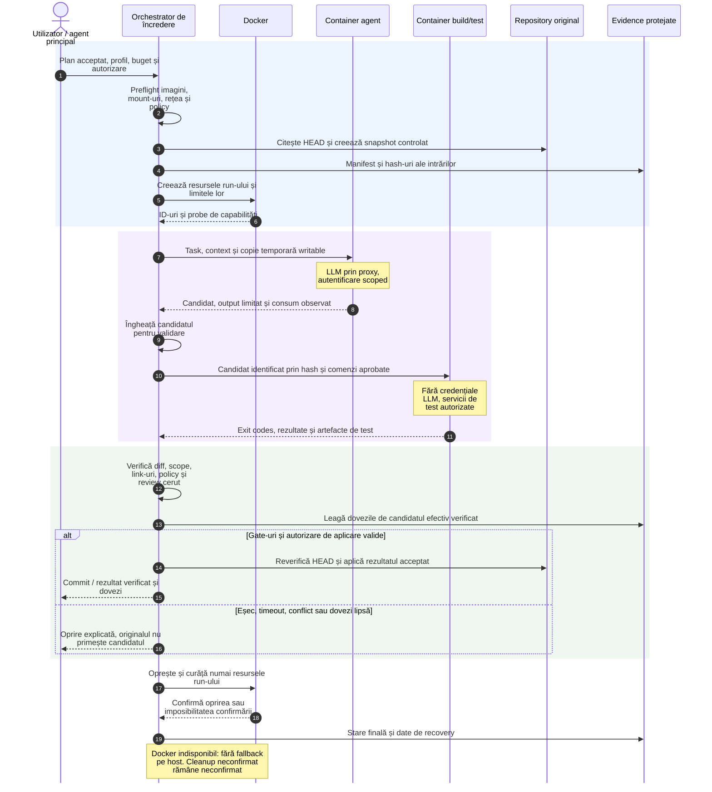

# Arhitectura Infoapex AI: prezent și ținta Docker

Actualizat la 2026-09-17, pe baza codului din `4a35fbc` și a planului RC-00–RC-08.
Diagramele de ansamblu sunt în [README](../README.md#cum-funcționează).

**Prezent:** RC intern `1.0.0-rc.1-internal`, cu execuție reală pe host prin
profilul `trusted-host` activat explicit. **Țintă:** execuție izolată în containere,
conform [planului RC](plans/RC-HARDENING-IMPLEMENTATION-PLAN.md), aprobat ca backlog,
dar neimplementat și necalificat integral. „Final” înseamnă aici finalul acestui
plan de izolare, nu toate ideile din roadmap.

## 1. Ce face proiectul

Infoapex AI transformă un obiectiv de programare într-un proces verificabil:
planificare, autorizare, execuție, validare și dovezi. Modelul propune conținut;
modulele stabilesc ce task se execută, pe ce fișiere, cu ce buget și ce probe sunt
necesare pentru acceptare. Proiectul consumator este repository-ul asupra căruia
lucrează agentul; `infoapex-ai` conține instrumentele care îl coordonează.

Modulele sunt programe CLI, nu microservicii pornite permanent. Comunică prin
subprocese, JSON, fișiere și scheme versionate. CLI-ul root nu rulează automat
întregul flux `plan → run → review → docs`. Utilizatorul sau agentul principal
coordonează pașii. Comanda `plan` produce un draft; inspectarea și compilarea lui
sunt pași expliciți înainte de execuție.

## 2. Componentele actuale

| Componentă | Responsabilitate | Rezultat și interacțiuni |
|---|---|---|
| **CLI root / installer** | Instalează configurația și deleagă comenzile către CLI-urile construite | JSON normalizat; `resume` verifică existența run-ului înainte de reluare |
| **ai-code-planner** | Descompune obiectivul, verifică schema și regulile; poate apela propriul adaptor LLM | Draft, plan compilat, dependențe și profile logice; nu implementează codul task-ului |
| **ai-code-worker** | Validează planul/politica, îngheață manifestul, ordonează task-urile | Worktree-uri, apeluri provider, gate-uri, commit-uri, checkpoint-uri și rapoarte |
| **ai-code-review** | Verifică cererea și draftul, cere context, coordonează review-ul | Deleagă la `worker review`; verdict `PASS / FAIL / BLOCKED`, constatări și acoperirea criteriilor |
| **ai-code-docs** | Verifică planul și contextul, obține planul worker | Apelează `worker run`, apoi `review run`; `DONE` numai dacă etapele obligatorii trec |
| **ai-code-control** | Memorie, simboluri, impact, context limitat și scope guard | CLI .NET și punte MCP; Markdown/ADR-uri canonice, SQLite reconstruibil |
| **ai-code-benchmark** | Evaluare separată pe experimente înghețate | Agent direct vs. orchestrare vs. orchestrare + context; CLI public și dovezi proprii |
| **Vizualizator local de dovezi** | Citește artefactele disponibile în `.infoapex-ai/runs/<runId>/` | UI read-only; nu este scheduler și nu citește automat toate datele din state root al worker-ului |

Worker-ul deține invocarea providerului **care scrie** cod sau documentație în fluxul
de producție. Nu este singurul loc cu apeluri LLM: planner-ul are adaptoare pentru
planificare, iar benchmark-ul are adaptoare directe pentru comparație. Review și
docs folosesc worker-ul pentru execuția providerului.

Control este opțional pentru arhitectura de bază planner/worker. Dacă un flux îl
cere explicit, indisponibilitatea lui poate bloca acel flux; docs verifică starea
control înainte de succes. „Advisory” nu înseamnă că toate erorile se ignoră.

## 3. Cum se execută astăzi un task

Diagrama urmărește profilul trusted-host. Fundalul albastru marchează planificarea,
iar cel verde execuția. Nota despre host explică limita reală a separării.

1. **Intenția devine contract.** Planner-ul produce task-uri și criterii. DAG înseamnă
   graf de dependențe fără cicluri: un task așteaptă dependențele sale.
2. **Worker-ul îngheață deciziile.** Rezolvă profilul logic în provider/model prin
   `.ai-code-worker/routing-policy.json`. Installerul curent setează
   `codex / gpt-6-astra / high`, cu un singur candidat pentru fiecare dintre cele două
   profile generate. Acest preset nu activează automat modelul „cel mai ieftin”.
3. **Execuția are limite.** Worker-ul persistă evenimente și checkpoint-uri și aplică
   bugete. Reparațiile sunt permise numai în limitele politicii. Mecanismul generic
   de fallback este restrâns la lista înghețată și la semnale de indisponibilitate;
   presetul curent nu configurează un provider alternativ. Scope/policy/gate failures
   nu justifică ocolirea verificărilor prin schimbarea motorului.
4. **Acceptarea cere dovezi.** Declarația agentului nu înlocuiește gate-urile.
   Commit-urile task-urilor se pot integra prin cherry-pick într-un worktree separat;
   conflictele pot produce `BLOCKED`.
5. **Review-ul verifică, nu repară.** Cere worker-ului review read-only. O remediere
   este un ciclu controlat separat. Pe host, intenția read-only și verificările nu
   oferă singure o graniță OS.
6. **Documentarea este tot muncă verificată.** Docs reutilizează planner, control,
   worker și review; nu pornește automat după orice verdict de review.

### Unde sunt datele

| Loc | Conținut și rol |
|---|---|
| Repository consumator | Cod, documentație, ADR-uri, planuri și configurații versionate: sursele canonice |
| `.ai-code-worker/execution-environment.example.json` | Profilul activ importat de installer, în ciuda sufixului istoric `example` |
| `.infoapex-ai/runs/<runId>/` | Canal opțional `integrated`: `planner-to-worker.json` transmite plan/rutare; `worker-to-planner.json` transmite status/feedback |
| State root al worker-ului, extern repository-ului implicit | Worktree-uri, manifeste, evenimente, checkpoint-uri, rapoarte; locație configurabilă conform politicii |
| `.ai-code-control/memory/` și sursele declarate | Rezumate revizuite și context canonic; fără secrete sau conversații brute |
| `.ai-code-control/db/` | Cache-uri SQLite pentru memorie și graf, reconstruibile |
| Stare separată a benchmark-ului | Observații, oracle-uri și rapoarte independente de autoevaluarea worker-ului |

Canalul `integrated` folosește fișiere, nu apeluri circulare. În modul `independent`,
planner-ul poate produce planuri fără worker, iar worker-ul poate primi direct un
plan. Un feedback de replanificare nu autorizează singur o nouă execuție.

### Ce există deja despre Docker

Codul conține `DockerExecutionEnvironment`, profiluri, probe și runner de provider
în container. Există și backend-ul `local-isolated`, care nu dovedește izolare OS
și nu permite automat un provider real. Aceste clase nu înseamnă că topologia finală
a trecut calificarea.

RC-ul actual permite `trusted-host` numai cu acknowledgement explicit. Nu există
fallback automat din Docker la host. Sunt limitate mediul transmis, timpul și
output-ul; nu sunt impuse granițe OS de filesystem/rețea sau limite OS de
CPU/memorie/procese. Cleanup-ul arborelui de procese este best-effort.
Vezi [profilul trusted-host](TRUSTED-HOST-RC.md).

## 4. Cum va funcționa varianta cu containere

Diagrama Docker din [README](../README.md#varianta-planificată-cu-docker) exprimă
cerințele RC-01–RC-05. Numele containerelor sunt **roluri conceptuale**, nu servicii
Compose livrate deja. Nu este necesar un container pentru fiecare modul CLI:
separarea se face după drepturi și tipul de cod executat.

| Zonă / rol planificat | Acces necesar | Separare cerută |
|---|---|---|
| **Host de încredere**: utilizator, orchestrator, policy, context | Citește surse, autorizează run-ul, controlează Docker, verifică rezultatul | Fără execuția scripturilor repository pe host; agentul principal și administratorul Docker sunt în afara izolării worker-ului |
| **Container agent**: provider CLI și tool-uri | Copie temporară writable, scratch, autentificare scoped, egress permis | Fără repository original writable, home utilizator, policy sau evidence writable |
| **Container de validare**: toolchain și runner | Snapshot identificat al rezultatului, scratch, dependențe pregătite | Fără credențiale LLM și fără egress-ul agentului; build/lint/test izolate |
| **Servicii de test**, numai când sunt necesare | DB/cache, rețea internă și date temporare per run | Fără acces implicit la producție; accesibile validării conform politicii |
| **Etapă izolată de dependențe** | Registries aprobate, cache controlat | Separată de build/test; scripturile de instalare nu rulează pe host; topologia exactă se definitivează în RC-03/RC-05 |
| **Proxy de egress** | Destinații aprobate și configurație verificată | Fără internet direct care ocolește proxy-ul; probe reale de trafic permis/interzis |
| **Stare și evidence ale orchestratorului** | Manifest, hash-uri, ID-uri containere, exit codes, diff-uri și rapoarte redactate | Agentul nu poate rescrie verdictul sau politica evaluării |

**Filesystem.** Se folosește export/snapshot sau metadate Git izolate, nu întregul
`.git` al utilizatorului montat writable. Originalul se modifică după verificarea
rezultatului, a căilor, a politicii și a HEAD-ului de bază.

**Rețea.** Profilul planificat este `restricted-agent-egress`: providerul și
subprocesele lui pot împărți accesul către destinațiile permise. Validarea separată
nu primește aceste drepturi. Proxy-ul nu împiedică exfiltrarea către o destinație
permisă; codul transmis serviciului LLM poate părăsi mașina.

**Secrete.** Autentificare scoped și revocabilă, fără secrete în imagini, prompturi,
loguri sau artefacte. Nu se promite că tool-urile providerului nu pot citi credențiala
accesibilă procesului lui. Un broker extern pentru secrete inaccesibile tool-urilor
este un profil separat, necuprins în acest RC.

**Procese.** Non-root, filesystem de bază read-only, capabilities eliminate,
`no-new-privileges`, limite de resurse și timp. Fără Docker socket în container,
`--privileged`, host network/PID sau mount de home. Zonele temporare autorizate
rămân writable; „read-only root” nu interzice aceste zone.

### Ordinea unui run izolat

Este traseul țintă, nu o implementare nouă. La crash/anulare, orchestratorul va
reconcilia resursele după identitățile persistate. Dacă daemonul nu răspunde, nu va
declara containerele oprite. Retry/reparația respectă bugetul și produce un candidat
cu dovezi proprii.

Review își păstrează execuția read-only; scrierile docs urmează același traseu
controlat. MCP oferă context scoped, iar cererile care execută cod, inclusiv
`run_validation`, trec prin runnerul autorizat. MCP și preflight nu trebuie să
devină căi de ocolire pe host.

## 5. Prezent versus țintă

| Aspect | RC intern actual, trusted-host | Ținta Docker, de implementat și calificat |
|---|---|---|
| Provider | Proces pe host, activat explicit | Container agent cu profil verificat |
| Copia de lucru | Worktree Git, separare logică | Snapshot/export cu graniță OS și mount-uri validate |
| Build/test | Poate executa cod pe host | Container separat, fără credențiale LLM |
| Internet | Drepturile contului host | Egress restricționat al agentului; validare separată |
| Politică și evidence | Controale de aplicație, drepturile contului | În afara zonelor writable ale agentului |
| Resurse și oprire | Timp/output bounded; cleanup best-effort | Limite OS, ID persistent, oprire verificată |
| Aplicarea rezultatului | Gate-uri, commit-uri, integrare în worktree | În plus: transfer controlat și reverificarea HEAD-ului original |
| Docker indisponibil | Host numai dacă ales explicit ca profil distinct | Run izolat blocat, fără fallback la host |
| Calificare | RC intern cu limitări documentate | Matrice T01–T36 pe artefactul candidat și gate-uri obligatorii |

Docker schimbă granița de execuție, nu înlocuiește modulele. Nici izolarea, nici
`DONE` nu autorizează automat merge, push, publicare sau deploy. Benchmark-ul măsoară
separat valoarea orchestrării; nu este o etapă obligatorie a fiecărui task.

## 6. Ce mai trebuie închis

| Pachet | Rezultat cerut |
|---|---|
| RC-00 | Profil, platforme, provider și contract de date aprobate |
| RC-01 | Transport provider și traducerea căilor host/container testate |
| RC-02 | Workspace, resurse, anulare și recovery verificabile |
| RC-03 | Rețea, proxy, secrete și dependențe separate, cu probe reale |
| RC-04 | Închiderea execuției repository pe host, inclusiv MCP/preflight |
| RC-05 | Provisionare reproductibilă, imagini pinned, instalare și rollback |
| RC-06 | SBOM complet, integritatea evidence și autorizare separată de publicare |
| RC-07 | Diagnostic și documentație conforme cu comportamentul efectiv |
| RC-08 | Calificare prin [matricea de validare](plans/RC-VALIDATION-AND-SCORING-PLAN.md) |

Kubernetes, SSO, multi-tenancy și un broker de comenzi Windows arbitrare nu intră
în acest RC. Windows cu containere Linux și Linux sunt propunerea inițială;
suportul final și situația macOS se decid explicit în RC-00.

## 7. Surse și verificabilitate

| Afirmație | Sursa inspectată |
|---|---|
| Delegarea comenzilor | [registry.ts](../src/registry.ts), [delegate.ts](../src/delegate.ts), [ADR-0003](adr/0003-unified-root-cli-delegation.md) |
| Apelurile planner-ului | [provider-registry.ts](../modules/ai-code-planner/src/engine/provider-registry.ts), [codex-adapter.ts](../modules/ai-code-planner/src/engine/codex-adapter.ts) |
| Execuție și integrare | [codex-run.ts](../modules/ai-code-worker/src/run/codex-run.ts), [integration.ts](../modules/ai-code-worker/src/run/integration.ts) |
| Backend-uri host/Docker | [environment.ts](../modules/ai-code-worker/src/execution/environment.ts), [TRUSTED-HOST-RC](TRUSTED-HOST-RC.md) |
| Review și documentare | [review.ts](../modules/ai-code-review/src/review.ts), [docs.ts](../modules/ai-code-docs/src/docs.ts) |
| Stare și preset | [state-root.ts](../modules/ai-code-worker/src/state/state-root.ts), [full-install.ts](../src/full-install.ts) |
| Benchmark și UI | [README benchmark](../modules/ai-code-benchmark/README.md), [evidence-viewer.ts](../src/evidence-viewer.ts) |
| Ținta containerizată | [Plan RC, secțiunile 4–5](plans/RC-HARDENING-IMPLEMENTATION-PLAN.md), [TODO](../todo.md) |

Repository-urile standalone dețin sursele reutilizabile; bundle-ul deține integrarea
și fixează commit-urile modulelor în `modules/provenance.json`. Vezi
[MODULE-PROVENANCE](MODULE-PROVENANCE.md). Diagramele nu modifică aceste contracte.

Graful de trasabilitate din acest checkout nu are încă surse declarate/ingerate
pentru aceste relații. Explicațiile provin din fișierele citate și inspecția codului,
nu dintr-o pretinsă dovadă `graph-drift: PASS`.
