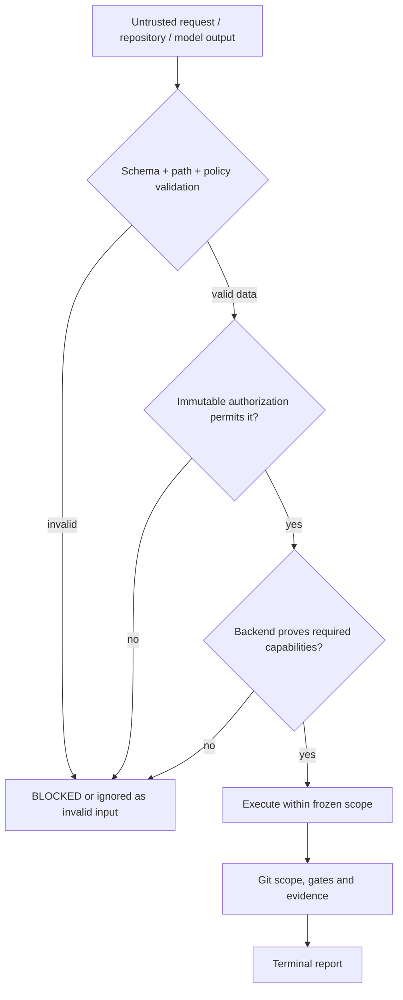

# infoapex-ai architecture

## Ownership

`ai-code-planner` owns intent, decomposition, deterministic linting and logical
execution-profile proposals. It never writes implementation code or claims that
the worker succeeded.

`ai-code-worker` owns compile-time validation, manifest freezing, routing policy
resolution, worktrees, engine invocation, commits, gates, evidence and terminal
status. It never imports planner code.

`ai-code-review` owns read-only milestone/repository review orchestration. It invokes
planner, control and worker only through CLI/JSON contracts and never writes the target
repository. The worker remains the owner of provider invocation and review isolation.

`ai-code-control` is an optional advisory context and memory provider. Its absence
must not block a planner or worker run.

`ai-code-docs` owns documentation orchestration. It invokes planner, control,
worker and review through their CLI/JSON contracts; worker remains the only
component allowed to invoke a writing provider.

## Optional bidirectional channel

The installer creates `.infoapex-ai/config.json`. In `independent` mode, the
modules do not use the channel. In `integrated` mode, both modules use the shared
`.infoapex-ai/runs/<runId>/` directory:

```text
planner-to-worker.json   planner -> worker plan and logical routing proposal
worker-to-planner.json   worker -> planner execution status and routing evidence
```

The channel is file-based and versioned. It is not a runtime dependency and it
does not create circular calls. A worker can still be run directly with a plan,
and a planner can still generate plans without a worker.

## Routing

The planner emits a logical `executionProfile`, for example
`balanced-default-v1`. The worker resolves it from the local
`.ai-code-worker/routing-policy.json` and freezes an ordered candidate list in
the manifest. Concrete model identifiers belong to local policy, not the
portable business plan.

Fallback is bounded to that frozen list and is permitted only for classified
provider availability signals. Scope violations, policy failures and deterministic
verification failures remain hard failures.

## Trust and security boundaries

Repository files, prompts, model output, command output and handoff payloads are
untrusted data. They can narrow a task or provide evidence, but they cannot grant a
new capability. Installed policy, versioned schemas, the immutable run authorization
and capability-probed execution backends form the enforcement boundary.

The integrated handoff channel is constrained to the canonical repository root.
Runtime code validates the config and complete handoff envelope, accepts only a
bounded single-segment `runId`, rejects absolute/traversing paths and symlink or
junction escapes, and publishes each message atomically as create-new. Reads apply
the same containment checks and verify both the requested run and direction. The
normative decision is [ADR-0001](adr/0001-safe-handoff-boundary.md).

A Git worktree and post-run scope verification are integrity controls, not an OS
sandbox. The bundled local process backend is therefore named `trusted-local` and
reports only controls it actually enforces. It does not claim host-filesystem,
network, process-count or process-tree isolation. An autonomous run that requires an
`isolated` profile remains `BLOCKED/ENVIRONMENT_UNAVAILABLE` until a probed backend
satisfies every required capability. The fake isolated backend is test-only.

Codex writers use `workspace-write` by default. `danger-full-access` is never an
automatic fallback: it requires a separate CLI/API approval with `authorizedBy`,
reason, timestamp and source, bound write-once to the run and represented in evidence.
Repository configuration may request the mode but cannot grant host privilege. The
same separation applies to `trusted-local`: project configuration requests
eligibility, while an external authorization is frozen into the run authorization.
A workspace-write permission failure blocks or follows the already-authorized engine
routing policy without increasing sandbox privileges.


