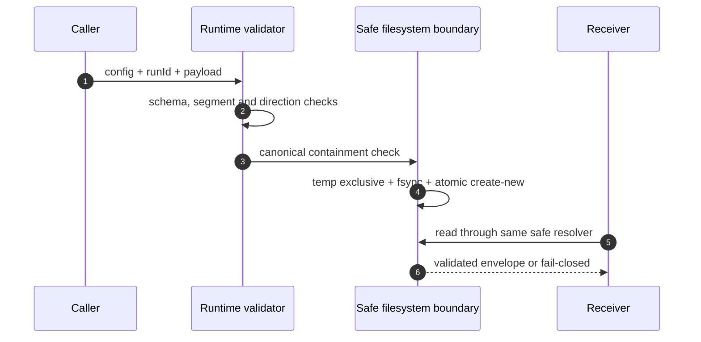

# Consolidarea P0–P3

Acest document fixează baseline-ul public pentru primele patru priorități de
consolidare și descrie contractele și rezultatele lor verificabile.

## Model de amenințare

Sunt tratate ca date neîncrezătoare:

- repository-ul consumator, inclusiv instrucțiuni Markdown și hook-uri;
- prompturile, output-ul modelului și output-ul comenzilor;
- payload-urile de handoff și fișierele descoperite în canalul integrat;
- identificatorii și path-urile primite din CLI sau JSON.

Fac parte din baza de încredere:

- policy-ul instalat și autorizația imutabilă a rulării;
- schemele JSON versionate și validarea runtime;
- compilatorul manifestului, scope guard-ul și verificarea Git;
- un backend de execuție numai pentru capabilitățile probate efectiv.

Un worktree izolează istoricul Git, nu host-ul. Un sandbox declarat în configurație nu
este considerat implementat doar pentru că profilul îl solicită.

## P0 — baseline și decizii

- [ADR-0001](adr/0001-safe-handoff-boundary.md) definește containment-ul și
  imutabilitatea handoff-ului.
- [AICW-ADR-008](../modules/ai-code-worker/docs/adr/0008-trusted-local-and-explicit-sandbox-escalation.md)
  definește raportarea sinceră a backend-ului local și aprobarea explicită pentru
  sandboxul Codex privilegiat.
- Contractele, implementarea, testele și documentația trebuie să exprime aceeași
  regulă. O contradicție eșuează închis; nu este rezolvată prin presupunere.

## P1 — canal de handoff

Obiectivul este ca nici configurația, nici `runId`, nici linkurile din filesystem să
nu poată devia operația în afara repository-ului. Publicarea este atomică și
create-new, iar citirea validează întregul envelope și identitatea solicitată.

## P2 — sandboxul Codex

Writer-ul pornește cu `workspace-write`. `danger-full-access` este acceptat numai cu o
aprobare externă și completă (`authorizedBy`, `reason`, `approvedAt`, `source`), unde
`source` poate fi numai `cli` sau `api`. Configurația din repository poate cere modul,
dar nu își poate acorda singură privilegii de host. Decizia este publicată atomic și
legată write-once de rulare în `sandbox-policy.json`; aceeași proveniență, inclusiv
`approvedAt`, trebuie refolosită la recovery. Decizia apare în doctor, evenimente și
raportul final. Un eșec de scriere în `workspace-write` nu declanșează retry cu
privilegii mai mari. Aceeași legare este aplicată înaintea oricărui writer Codex,
inclusiv când acesta este ales drept candidat prin rutarea unui run pornit cu Claude;
un blocker de policy nu este reinterpretat drept indisponibilitate și nu activează
fallback-ul de motor.

## P3 — backend-ul de execuție

Backend-ul local este `trusted-local`. El poate controla mediul transmis procesului,
timeout-ul și limita de output, dar nu pretinde izolare de filesystem/rețea, limită de
procese sau anularea verificabilă a întregului process tree. Dacă autorizația cere
`isolated`, rularea autonomă rămâne blocată până când există un backend real care
probează toate capabilitățile. Un repository poate doar solicita eligibilitatea
`trusted-local`; aprobarea efectivă vine separat din CLI/API, este înghețată în
`run-intent.json` și `authorization.json`, iar writer-ul real este legat de backend-ul
și digestul profilului autorizat. Evenimentul de pornire și raportul final păstrează
capability report-ul și avertismentul `host-process`. Backend-ul fake rămâne exclusiv
pentru teste.

## Matrice de acceptare

| Prioritate | Proprietate | Dovadă minimă |
|---|---|---|
| P0 | deciziile și limitele de trust sunt versionate | ADR-uri acceptate, arhitectură sincronizată |
| P1 | nicio evadare de path și niciun overwrite | teste negative Windows/POSIX, symlink/junction și concurență |
| P2 | niciun upgrade implicit la `danger-full-access` | teste default, approval invalid/lipsă, evenimente și raport |
| P3 | nicio capabilitate declarată fără enforcement | capability report și blocare `isolated` pe backend local |

## Non-obiective

Această etapă nu afirmă că livrează un sandbox OS portabil. Un viitor backend bazat
pe container, VM, sandbox nativ sau runner remote poate implementa contractul
`isolated`, dar va fi activat numai după probe negative pentru filesystem, rețea,
limite și anularea process tree-ului pe platforma respectivă.
