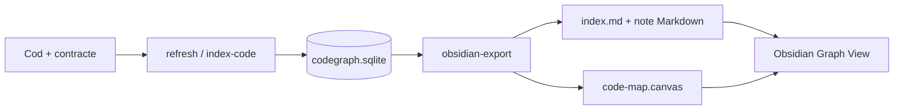
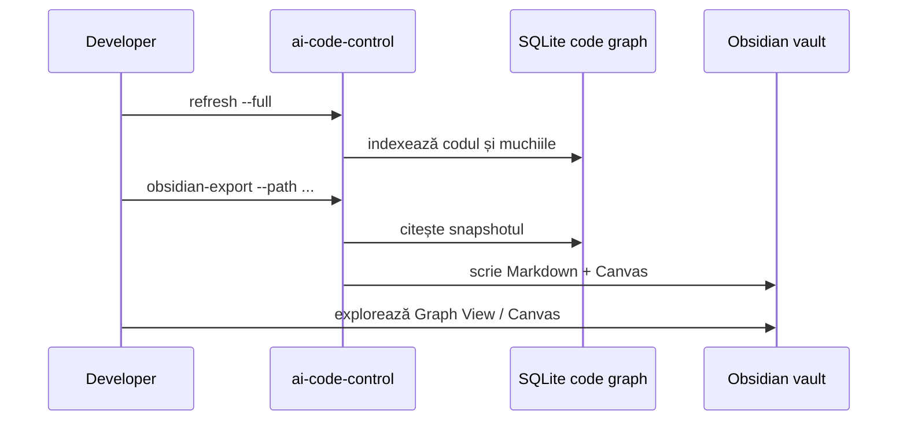

# Code map Obsidian

`ai-code-control obsidian-export` proiectează graful de cod SQLite în note Markdown și un fișier Canvas compatibil cu Obsidian. Este o vedere pentru oameni, nu un nou index semantic și nu o sursă de adevăr.



## Principiul sursei de adevăr

Ordinea rămâne:

1. codul, contractele și deciziile versionate;
2. indexul SQLite ca cache reconstruibil;
3. exportul Obsidian ca proiecție pentru navigare și orientare.

Nu edita manual notele generate pentru a schimba codul și nu configura plannerul sau workerul să depindă de Obsidian. Dacă exportul este șters, poate fi recreat prin `refresh` și `obsidian-export`.

## Pornire rapidă

Din rădăcina unui proiect care are `ai-code-control` configurat:

```bash
dotnet run --project tools/ai-code-control/src/AiCodeControl.Cli -- refresh --full
dotnet run --project tools/ai-code-control/src/AiCodeControl.Cli -- obsidian-export
```

Exportul implicit este:

```text
docs/code-map/generated/
├── index.md
├── modules/*.md
├── files/*.md
├── symbols/*.md          # doar cu --include-symbols
├── canvases/code-map.canvas
└── .export-manifest.json  # proveniență și hash-uri
```

Directorul implicit este ignorat de Git pentru a evita commit-uri generate la fiecare indexare. Un vault extern poate fi folosit explicit:

```bash
dotnet run --project tools/ai-code-control/src/AiCodeControl.Cli -- obsidian-export \
  --path modules/ai-code-worker \
  --out C:/vaults/infoapex-code-map \
  --include-symbols \
  --max-symbols 250
```

Același flux este disponibil prin tool-ul MCP `obsidian_export`, cu argumentele `path`, `out`, `includeSymbols` și `maxSymbols`.

## Opțiuni

| Opțiune | Implicit | Rol |
|---|---|---|
| `--path <scope>` | `.` | limitează exportul la un director din repository; nu acceptă traversal în afara lui |
| `--out <vault>` | `docs/code-map/generated` | directorul în care sunt scrise notele; poate fi un vault extern ales explicit |
| `--include-symbols` | dezactivat | generează note individuale pentru simbolurile selectate |
| `--max-symbols <n>` | `250` | limitează snapshot-ul de simboluri și reduce zgomotul în Graph View |

Exporterul nu șterge fișiere vechi. Pentru un vault dedicat, folosește un director nou sau o politică separată de curățare după ce verifici `.export-manifest.json`.

## Ce se generează

`index.md` conține proprietăți YAML, commitul și branch-ul indexului, numărul de fișiere/module/muchii, linkuri interne și o diagramă Mermaid a modulelor.

Notele de modul grupează fișierele după domeniu (`modules/ai-code-worker`, `src`, `docs` etc.) și listează dependențele între module.

Notele de fișier păstrează calea, limbajul, hash-ul indexat și simbolurile găsite. Notele de simbol sunt opționale deoarece exportarea tuturor simbolurilor poate produce un graf greu de folosit.

Canvas-ul este o vedere de ansamblu pe module. Relațiile detaliate se explorează mai bine prin Graph View sau prin `impact-analysis`.

## Workflow recomandat



Pentru un task punctual, folosește `--path` și `--include-symbols` cu o limită mică. Pentru arhitectura generală, exportă fără simboluri și păstrează doar hărțile de module.

## Proprietăți și trasabilitate

Notele au proprietăți precum:

```yaml
type: code-file
source_path: modules/ai-code-worker/src/run/claude-run.ts
language: typescript
source_hash: "..."
source_commit: "..."
generated_at: "..."
```

Aceste valori permit detectarea unei hărți vechi. Dacă `source_commit` sau `source_hash` nu mai corespund indexului curent, regenerează exportul.
Proprietatea `working_tree_dirty` avertizează când exportul a fost făcut peste modificări locale necomise; într-un review de release, preferă un index construit pe un commit curat.

## Securitate și confidențialitate

- exportul nu include transcripturi brute, token-uri, secrete sau baza SQLite;
- notează doar metadate de cod, simboluri, relații și hash-uri;
- un vault extern poate conține căi locale și nume interne ale proiectului, deci tratează-l ca date private;
- nu activa sincronizare/publicare pentru acest vault fără o politică explicită de acces;
- nu folosi notele generate ca mecanism de autorizare pentru worker.

## Limite cunoscute

- graf-ul reflectă precizia indexerului curent, nu semantică completă de compilator;
- simbolurile duplicate sunt deduplicate determinist pentru export;
- Graph View vede linkuri Markdown, nu interogări SQLite live;
- actualizarea este batch, nu streaming la fiecare salvare de fișier;
- Canvas-ul este orientativ; `impact-analysis` rămâne mecanismul precis pentru blast radius.

## Extensii ulterioare

- export incremental doar pentru fișierele schimbate;
- linkuri directe către commituri și review findings;
- filtre de limbaj, accesibilitate și risc;
- plugin Obsidian opțional care pornește `refresh`/`obsidian-export` și indică staleness;
- vizualizare de task-uri, gate-uri și evenimente worker lângă harta codului.
