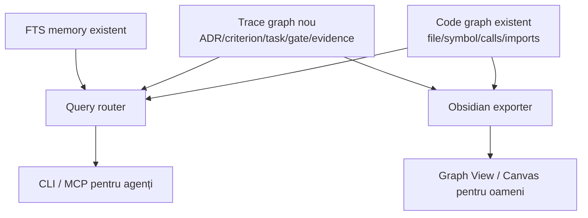

# Plan de implementare — Graph Engineering pentru Infoapex AI

Status: **core implementation and internal common pilot complete; live pilot pending; GRAPH-06 optional**  
Repository baseline: `92f79b6535da79a0a81695899f98b59ca3869bd8`  
Model baseline: `gpt-5.6-sol`  
Reasoning baseline: `high`  
Prerequisite: [ICM-SELECTIVE-IMPLEMENTATION-PLAN.md](ICM-SELECTIVE-IMPLEMENTATION-PLAN.md), minimum ICM-00, ICM-01, ICM-02 și ICM-05 contractele stabilizate.

## 1. Decizia

Infoapex AI va implementa graph engineering numai ca extensie a mecanismelor existente:

1. păstrează DAG-ul de execuție din `ai-code-worker`;
2. păstrează graful de cod SQLite și `impact-analysis` din `ai-code-control`;
3. adaugă un graf separat de trasabilitate, decizii și evidence;
4. extinde Obsidian ca proiecție a grafului, nu ca motor pentru agenți;
5. tratează parallel reviewer graph ca experiment opțional pentru taskuri cu risc ridicat;
6. nu implementează GraphRAG, embeddings sau Neo4j fără un benchmark care demonstrează necesitatea.



## 2. Separarea grafurilor

### Execution graph

Există deja în worker: DAG, ready waves, concurrency policy, snapshots, invalidarea descendenților, repair și graph revisions. Nu va fi înlocuit.

### Code graph

Există deja în SQLite și modelează relații între simboluri. Rămâne optimizat pentru blast radius și impact analysis.

### Trace graph

Este noul strat propus și răspunde la:

- „De ce există această regulă?”
- „Ce criteriu a produs acest task?”
- „Ce cod implementează contractul?”
- „Ce gate și evidence verifică rezultatul?”
- „Care ADR este curent și ce decizie a supersedat?”

### Obsidian graph

Rămâne o proiecție batch pentru oameni. Workerul nu citește vault-ul și nu folosește wikilink-uri pentru authorization sau enforcement.

## 3. Modelul de date recomandat

Nu se reutilizează tabela `edges(from_symbol, to_symbol, edge_type, file_id)` pentru entități eterogene. Se introduc tabele separate, rebuildable:

```text
trace_nodes
  node_id
  node_type
  canonical_ref
  title
  source_hash
  source_commit
  valid_from
  valid_to
  properties_json

trace_edges
  edge_id
  from_node_id
  to_node_id
  edge_type
  origin
  confidence
  evidence_ref
  source_hash
  source_commit
  valid_from
  valid_to
  properties_json
```

Tipuri inițiale de nod:

```text
adr, rule, contract, criterion, task, run,
gate, evidence, commit, file, symbol, context-package
```

Tipuri inițiale de muchie:

```text
supersedes
depends_on
implements
verified_by
derived_from
changes
references
selected_for
```

`caused` nu intră în vocabularul automat. Poate exista ulterior numai ca muchie declarată și aprobată, cu evidence.

## 4. Niveluri de încredere și enforcement

| Nivel | Origine | Exemple | Permis la enforcement |
|---|---|---|---|
| T0 deterministic | AST, Git, JSON contract, runtime evidence | `calls`, `changes`, `verified_by` executat | Da |
| T1 declared | ADR, frontmatter validat, manifest | `supersedes`, `depends_on`, `implements` declarat | Da, conform policy |
| T2 inferred | model/LLM | relație semantică sugerată | Nu; advisory only |

Reguli:

- o muchie fără origin și evidence/provenance este invalidă;
- entity resolution ambiguă produce diagnostic, nu alegerea primului simbol;
- relațiile temporale păstrează istoria; nu se suprascriu în loc;
- numai T0/T1 pot influența routing, invalidation sau verdict;
- T2 se exportă separat și nu apare implicit în răspunsurile authoritative.

## 5. Etapele Graph Engineering

### GRAPH-00 — Audit de query și ADR de arhitectură

Prioritate: **P0**  
Depinde de: ICM-00 pentru checkpoint-uri curate.

Livrabile:

- inventar de minimum 25 întrebări reale, împărțite între FTS, code graph și trace graph;
- baseline: răspuns, latență, context size, evidence completeness;
- ADR care fixează SQLite, separarea `code_edges`/`trace_edges`, tier-urile și temporalitatea;
- threat model pentru path leakage, stale data și muchii inferate;
- query routing policy: text simplu → FTS, simbol/blast radius → code graph, why/current/evidence → trace graph.

Gate:

- fiecare întrebare are expected nodes/edges și sursă verificabilă;
- nu se implementează un tip de muchie fără minimum două use cases reale.

Rezultat la 2026-08-28:

- auditul măsurat conține 25 de întrebări: 10 FTS, 10 code graph și 5 trace graph;
- FTS + code graph oferă răspuns executabil și sursă verificabilă pentru `20/25`
  întrebări (`80%`), dar numai `14/25` sunt răspunsuri directe complete (`56%`);
- toate cele 5 întrebări multi-hop de tip why/current/criterion/evidence sunt corect
  clasificate `unsupported`, fără fallback silențios la FTS;
- latența medie locală pentru query-urile suportate este `177 ms`; problema măsurată
  este forma răspunsului și lipsa trasabilității, nu scalarea bazei de date;
- output-ul mediu este aproximativ `346` tokeni pentru FTS și `1,064` pentru code
  graph; două căutări de clasă au produs câte 37 de rezultate și peste 3,000 tokeni;
- fiecare tip inițial de muchie are minimum două use cases concrete, iar `caused`
  automat este respins;
- ADR-0011 acceptă arhitectura hibridă SQLite, temporalitatea, T0/T1/T2, separarea
  `edges` de `trace_edges` și rolul Obsidian exclusiv ca proiecție pentru oameni.
- actualul GRAPH-00 este `1,855,246` tokeni față de `1.5M / 2.0M / 2.5M` estimat:
  `GREEN`, eroare `-7.24%`, range hit; usage mapping este comparabil la `7 pp` și
  `265,035 tokeni/pp`, cu drift de aproximativ `+7.46%` față de calibrarea
  `ICM-CLEAN-V1-2026-08-28`.

Artefacte: `modules/ai-code-control/docs/GRAPH-QUERY-AUDIT.md` și
`modules/ai-code-control/.ai-code-control/memory/decisions/ADR-0011-hybrid-code-trace-graph.md`.

### GRAPH-01 — Schema, migrarea și repository API

Prioritate: **P0**  
Depinde de: GRAPH-00 și contractele ICM de ID/provenance.

Livrabile:

- schema SQLite pentru `trace_nodes`, `trace_edges`, indexes și ingest runs;
- migration idempotent și compatibility tests;
- stable node IDs bazate pe namespace și canonical ref, nu pe titlu liber;
- API de upsert temporal și invalidare per source commit;
- validare a edge vocabulary și tier/origin;
- rebuild complet fără pierderea surselor canonice.

Gate:

- două rebuild-uri pe aceleași surse produc același graf;
- schimbarea unui titlu nu schimbă node ID dacă canonical ref rămâne stabil;
- o muchie expirată nu este returnată ca `current`;
- SQLite rămâne cache, nu source of truth.

Rezultat la 2026-08-28:

- schema v3 adaugă `trace_nodes`, `trace_edges`, indexuri current și
  `trace_ingest_runs`, fără să modifice tabela structurală `edges`;
- migrarea este idempotentă, păstrează muchiile de cod și marchează versiunea numai
  după aplicarea cu succes a structurii;
- `TraceGraphRepository` oferă upsert temporal, invalidare compare-and-set după source
  commit, current/history reads și full rebuild tranzacțional;
- IDs sunt derivate din namespace + canonical ref; titlul și ordinea proprietăților
  JSON nu afectează identitatea sau digestul;
- repository-ul și constrângerile SQLite validează vocabularul, origin/tier/confidence,
  evidence refs, endpoint-uri, monotonicitatea temporală și căile relative;
- invalidarea care ar produce o muchie cross-source suspendată este blocată;
- două rebuild-uri cu ordini diferite produc același digest, iar versiunile expirate nu
  apar în current state;
- control tests `76/76`, generic boundary, scope verification și validation runner trec;
- actualul GRAPH-01 este `3,791,967` tokeni față de `3.5M / 4.6M / 5.8M` estimat:
  `GREEN`, eroare `-17.57%`, range hit; usage mapping este comparabil la `15 pp` și
  aproximativ `252,798 tokeni/pp`, cu drift de `+2.50%` față de calibrarea ICM.

### GRAPH-02 — Ingest determinist și declarat

Prioritate: **P0**  
Depinde de: GRAPH-01 și ICM-05.

Surse:

- ADR-uri și relații `supersedes` declarate;
- contracte și criterii cu IDs stabile;
- planner tasks și dependencies;
- worker runs, commits, gates și evidence;
- source maps și context packages ICM;
- code index pentru file/symbol nodes și legături către trace graph.

Livrabile:

- parsere deterministe pentru referințe explicite;
- frontmatter/JSON schema pentru relațiile declarate;
- entity-resolution diagnostics;
- ingest incremental pe source hash/commit;
- fără LLM în calea T0/T1.

Gate:

- precision minimum `95%` pe setul verificat manual;
- `100%` dintre muchiile de enforcement au provenance și evidence;
- simbolurile ambigue rămân unresolved;
- niciun document `proposed` nu este indexat ca decizie acceptată.

Rezultat la 2026-08-28:

- ingestia acceptă numai documente declarate de tip ADR, contract, plan, source map,
  context package și sidecar `trace-relations.v1`; nu scanează arbitrar și nu apelează LLM;
- code index contribuie noduri file/symbol, dar un nume simplu se leagă numai dacă are
  exact un candidat; zero sau mai mulți candidați produc diagnostic și muchia este omisă;
- relațiile ICM sunt normalizate determinist: `requires→depends_on`,
  `implemented_by→implements` cu inversarea direcției și `changed_by→changes` cu inversare;
- authority `proposed` este păstrată explicit, iar sursele multiple pentru aceeași
  identitate sunt îmbinate prin precedență deterministă și diagnostic de provenance;
- canonical JSON hash și digesturile semantice evită invalidarea pe ordinea proprietăților
  sau timestamp; schimbarea unui ADR a versiuniat numai nodul și muchia susținută de el;
- setul verificat manual are `100%` precision pe triplele semantice așteptate și `100%`
  evidence/provenance pentru muchiile produse; simbolul ambiguu `Run` a rămas unresolved;
- control tests `79/79`, generic boundary, scope verification și validation runner trec;
- actualul GRAPH-02 este `4,245,743` tokeni față de `4.0M / 5.4M / 6.8M` estimat:
  `YELLOW`, eroare `-21.38%`, dar range hit; usage mapping este comparabil la `16 pp`
  și aproximativ `265,359 tokeni/pp`, cu drift de `+7.60%` față de calibrarea ICM;
- agregat GRAPH-00..02: `GREEN`, MAPE `15.4%`, range hits `100%`, mapping median
  `265,035 tokeni/pp`.

### GRAPH-03 — Traversare și query surface

Prioritate: **P0**  
Depinde de: GRAPH-02.

Comenzi recomandate:

```text
ai-code-control trace <entity> [--depth N]
ai-code-control why <symbol-or-file>
ai-code-control affected <contract-or-adr>
ai-code-control current <adr-or-rule>
ai-code-control evidence-for <criterion-or-task>
```

Aceleași operații se expun prin MCP cu output JSON validat.

Guardrails:

- depth, node și edge budget obligatorii;
- cycle detection;
- provenance în fiecare rezultat;
- răspuns distinct pentru `not_found`, `ambiguous`, `stale` și `partial`;
- query router nu folosește trace graph pentru lookup-uri simple când FTS/code graph este mai precis;
- răspunsurile T2 sunt opt-in și marcate advisory.

Gate:

- minimum `90%` accuracy pe cele 25 de întrebări preregistrate;
- `100%` dintre răspunsurile authoritative includ calea de evidence;
- nicio traversare nu depășește bugetul configurat;
- latența p95 pentru graf local rămâne sub pragul preregistrat după măsurarea baseline-ului.

Rezultat la 2026-08-28:

- au fost adăugate comenzile `trace`, `why`, `affected`, `current` și
  `evidence-for`, împreună cu tool-urile MCP echivalente și output JSON camel-case;
- toate răspunsurile declară ruta, lipsa fallback-ului, freshness, provenance, evidence
  paths și limitele efective; raw `properties_json` nu traversează boundary-ul CLI/MCP;
- rezoluția exactă precedă numele simplu, simbolurile ambigue nu aleg primul candidat,
  iar `not_found`, `unsupported`, `ambiguous`, `stale` și `partial` sunt distincte;
- T2 este exclus implicit; opt-in-ul produce rezultat advisory și non-authoritative;
- hard caps sunt depth 10, 200 nodes și 500 edges, cu cycle detection și motive de
  truncation; testele confirmă că niciun rezultat nu depășește bugetul;
- inventarul preregistrat are 25/25 route/entity/evidence accuracy: 20/20 pentru rutele
  FTS/code graph și 5/5 pentru noile rute trace; direct completeness separat este 19/25;
- p95 end-to-end pentru cele 20 de query-uri existente este 173 ms; p95 local trace
  pe 100 de execuții warm este 2.572 ms față de pragul preregistrat de 250 ms;
- control tests 92/92, MCP build, generic boundary, scope verification și validation
  runner trec;
- actualul GRAPH-03 este 5,841,348 tokeni față de 3.2M / 4.4M / 5.5M estimat:
  YELLOW, +32.76% față de mediană și 6.21% peste high; usage mapping este comparabil la
  23 pp și aproximativ 253,972 tokeni/pp, +2.98% față de calibrarea ICM;
- agregat GRAPH-00..03: YELLOW, MAPE 19.7%, range hits 75% și mapping median
  259,503 tokeni/pp.

### GRAPH-04 — Obsidian ca proiecție tipizată

Prioritate: **P1**  
Depinde de: GRAPH-03.

Livrabile:

- note pentru ADR, contract, criterion, task, gate și evidence;
- wikilink-uri cu edge type explicit;
- filtre T0/T1/T2 și current/superseded;
- manifest de export cu schema version, commit și source hashes;
- export într-un staging directory și swap controlat pentru a nu păstra fișiere generate stale;
- Canvas separat pentru code overview și trace overview;
- linkuri din trace nodes către code nodes, fără duplicarea sursei canonice.

Gate:

- ștergerea unei entități din index elimină nota generată la următorul export controlat;
- workerul și plannerul funcționează identic dacă vault-ul lipsește;
- Obsidian nu devine dependency de runtime;
- manifestul detectează commit/hash drift.

Rezultat implementat (2026-08-28):

- `obsidian-export` proiectează separat code map și trace map; note tipizate sunt generate
  pentru ADR, rule, contract, criterion, task, gate și evidence;
- fiecare relație păstrează edge type-ul explicit și leagă nodurile trace de notele de
  fișier/simbol atunci când endpoint-ul există în code map;
- filtrul implicit este current T0/T1; T2 și superseded sunt opt-in prin
  `--include-advisory` și `--include-superseded`, inclusiv prin MCP;
- exportul folosește staging + directory swap, astfel încât o entitate eliminată nu
  lasă o notă stale, iar un export eșuat nu publică un vault parțial;
- `canvases/code-map.canvas` și `canvases/trace-map.canvas` rămân vederi distincte;
- `.trace-projection-manifest.json` respectă schema v1 și include digestul complet al
  grafului, commitul repository-ului și setul exact de source hashes authoritative;
- gate-ul GRAPH-05 acceptă manifestul imediat după export și detectează digest drift
  după orice schimbare ulterioară a grafului;
- cache-urile SQLite existente sunt migrate idempotent la fiecare deschidere CLI,
  eliminând eroarea `no such table: trace_nodes` observată în smoke test;
- control tests 109/109, MCP build și validarea strictă AJV a manifestului generat trec;
  4 teste sunt dedicate GRAPH-04.
- actualul GRAPH-04 este 6,137,379 tokeni față de 2.5M / 3.4M / 4.3M estimat:
  RED, +80.51% față de mediană și 42.73% peste high; usage mapping nu este comparabil
  deoarece fereastra de rate limit s-a resetat între checkpoint-uri (86% → 9%);
- agregat GRAPH-00..05: RED, MAPE 51.9%, range hits 50% și mapping median 265,035
  tokeni/pp pe cele cinci etape cu usage comparabil.

### GRAPH-05 — Graph drift și enforcement gates

Prioritate: **P0 pentru release**  
Depinde de: GRAPH-02–04.

Comandă recomandată:

```text
ai-code-control graph-drift --scope . --format json
```

Raportul verifică:

- surse canonice fără nod;
- noduri fără sursă;
- muchii dangling sau cu vocabular necunoscut;
- relații current/superseded contradictorii;
- hash/commit staleness;
- projection drift între SQLite și manifestul Obsidian;
- trace coverage criterion → task → gate → evidence;
- diferențe față de expected graph fixtures.

Clasificare:

- `PASS`: zero erori T0/T1 și coverage peste prag;
- `REVIEW_REQUIRED`: muchii T2, entități ambigue sau surse neacoperite neobligatorii;
- `FAIL`: edge dangling, current conflict, missing mandatory evidence sau projection care pretinde commit curent cu hash vechi.

Rezultat core la 2026-08-29:

- comanda `graph-drift --scope . --format json` și tool-ul MCP `graph_drift`
  raportează determinist `PASS`, `REVIEW_REQUIRED` sau `FAIL`;
- source presence nu poate obține fals `PASS`: lipsa unui source manifest produce
  `REVIEW_REQUIRED`, iar sursele required lipsă, non-authoritative sau cu hash greșit
  produc `FAIL`;
- sunt verificate vocabularul, hashurile, endpoints, ingest-run provenance, commit
  freshness, identitățile ambigue, T2, endpoints proposed/advisory, branching și cicluri
  `supersedes`;
- coverage cere lanțul authoritative task → criterion → gate → evidence și aplică pragul
  configurat; evidence incomplet sub prag produce `FAIL`;
- expected fixtures suportă `exact` și `subset`, cu diff stabil pentru nodes și edges;
- contractul projection manifest verifică graph digest, source commit și setul complet de
  source hashes; până la GRAPH-04, lipsa lui este explicit `not_applicable`;
- cele trei contracte JSON Schema și exemplele lor trec validarea AJV strict;
- fișierele declarate sunt limitate la 2 MiB, nu pot ieși din root scope, iar erorile nu
  expun căi absolute; v1 respinge un sub-scope în loc să eticheteze greșit întregul graf;
- cache-ul local încă gol raportează `REVIEW_REQUIRED`, iar `--fail-on-review` produce
  exit code 2, deci nu poate fi folosit ca release pass înainte de ingestie;
- control tests 105/105, MCP build, generic boundary, scope verification și validation
  runner trec; 13 teste sunt dedicate GRAPH-05.
- actualul GRAPH-05 este 8,822,036 tokeni față de 2.5M / 3.5M / 4.5M estimat:
  RED, +152.06% față de mediană și 96.05% peste high; usage mapping este comparabil la
  30 pp și aproximativ 294,068 tokeni/pp, +19.24% față de calibrarea ICM;
- agregat GRAPH-00..05: RED, MAPE 46.2%, range hits 60% și mapping median
  265,035 tokeni/pp.

### GRAPH-06 — Parallel reviewer graph, experiment opțional

Prioritate: **P2 / nu face parte din core release**  
Depinde de: GRAPH-05 și un baseline stabil de usage.

Se activează numai pentru taskuri `high` cu minimum trei verificări independente:

```text
Worker
  ├── security reviewer
  ├── contract reviewer
  └── logic reviewer
          ↓
      synthesis gate
          ↓
   pass | targeted repair
```

Experiment A/B:

- A: aceiași revieweri executați secvențial;
- B: aceiași revieweri executați paralel;
- același model, effort, prompt, diff și stopping policy;
- se compară wall-clock, total tokens, finding recall, false positives, repair cycles și cost per successful task.

Go gate:

- minimum `30%` reducere wall-clock;
- finding recall nu scade;
- total tokens per successful task nu crește cu mai mult de `25%`;
- repair cycles nu cresc;
- altfel experimentul rămâne dezactivat.

### GRAPH-07 — Pilot comun ICM + Graph și release decision

`GRAPH-07` este numai identificatorul de tracking al pilotului comun deja prevăzut în
plan; nu introduce o a douăsprezecea funcționalitate sau o etapă suplimentară față de
„Pilot comun ICM + Graph”. Numărul 06 rămâne rezervat experimentului opțional cu
revieweri paraleli.

Prioritate: **P0 pentru declararea valorii**  
Depinde de: GRAPH-05; GRAPH-06 este opțional.

Pilot:

- minimum 25 de query fixtures și 10 taskuri reale;
- minimum 5 lanțuri temporale/supersession;
- minimum 5 schimbări contract → code → evidence;
- minimum 5 query-uri blast-radius care folosesc code graph, nu trace graph;
- minimum 5 query-uri simple care rămân pe FTS;
- Un proiect consumator extern, plus fixtures generice Infoapex.

Stop condition:

- dacă trace graph nu îmbunătățește evidence completeness sau timpul de răspuns la query-uri multi-hop, nu se extinde către GraphRAG;
- dacă entity resolution este sub 95%, se repară ingestul înainte de noi edge types;
- dacă contextul generat crește peste baseline fără îmbunătățire de accuracy, se reduce traversal budget.

Rezultat intern (2026-08-29):

- pilotul comun rulează prin `npm run pilot:icm-graph:internal` într-un repository
  consumator generic, izolat și temporar;
- ICM: 20/20 taskuri DONE, coverage/evidence/first-pass gate 100% și invalidation 5/5;
- Graph: 25/25 query fixtures, 10 taskuri traceable, 5 supersession chains, 5/5
  contract → code → evidence, 5/5 blast-radius structural și 5/5 FTS;
- ingest: 17/17 documente, 70 noduri, 55 muchii și zero diagnostics error/warning;
- graph drift PASS, evidence coverage 100% și projection drift PASS;
- prima execuție a blocat corect la 15/25 din două erori ale harness-ului; contractul
  public și izolarea scenariilor au fost corectate fără relaxarea pragurilor;
- verdict: `INTERNAL_PASS_LIVE_REQUIRED`; pilotul provider-live cu 10 taskuri bounded
  rămâne gate de release cu usage real și necesită autorizare explicită;
- GRAPH-06 rămâne dezactivat și nu face parte din core release.
- măsurare GRAPH-07: `10,080,331` tokeni față de `2.2M / 3.0M / 4.0M`
  estimat, deci `RED`, `+236.01%` față de mediană și `+152.01%` peste limita
  superioară; usage-ul comparabil a fost `33 pp`, aproximativ `305,465 tokeni/pp`
  (`+23.86%` față de calibrarea ICM);
- agregat GRAPH-00–07: `RED`, MAPE `78.2%`, range hit `42.9%` și mediană
  `265,197 tokeni/pp`. Estimarea curentă nu este suficient de precisă pentru a
  fundamenta GRAPH-06 sau bugete live fără un baseline nou.

## 6. Ordine și strategie de agenți

| Ordine | Etapă | Agent principal | Review recomandat | Paralelism provider |
|---:|---|---|---|---|
| 1 | GRAPH-00 | Sol/high | review arhitectură | Nu |
| 2 | GRAPH-01 | Sol/high | review DB/migrare într-o sesiune nouă | Nu |
| 3 | GRAPH-02 | Sol/high | review entity resolution + provenance | Nu |
| 4 | GRAPH-03 | Sol/high | review query/security | Nu |
| 5 | GRAPH-05 | Sol/high | review independent de evidence | Nu |
| 6 | GRAPH-04 | Sol/high | review export/staleness | Nu în calibrare |
| 7 | GRAPH-07 | Sol/high | gate determinist + review uman | Nu pentru baseline |
| 8 | GRAPH-06 | Sol/high per reviewer | A/B controlat | Da, numai experiment |

Ordinea GRAPH-05 înainte de finalizarea GRAPH-04 este intenționată: graful authoritative trebuie verificat înainte de a investi în vizualizarea completă. Implementarea poate livra un check minimal în GRAPH-03 și îl poate extinde după export.

## 7. Estimare de tokeni și usage

Estimarea folosește baseline-ul ICM pentru `gpt-5.6-sol/high`. Până când ICM-00 produce minimum 5 samples curate, intervalul conservator rămâne `120k–170k total reported tokens` per punct procentual 5h-equivalent. Procentele nu sunt cost API și nu trebuie comparate cu alte modele sau effort-uri.

| Etapă | Low tokens | Probabil | High tokens | Usage estimat low–high | Prioritate |
|---|---:|---:|---:|---:|---|
| GRAPH-00 audit + ADR | 1.5M | 2.0M | 2.5M | 9–21 pp | P0 |
| GRAPH-01 schema + repository API | 3.5M | 4.6M | 5.8M | 21–48 pp | P0 |
| GRAPH-02 ingest + entity resolution | 4.0M | 5.4M | 6.8M | 24–57 pp | P0 |
| GRAPH-03 queries + CLI/MCP | 3.2M | 4.4M | 5.5M | 19–46 pp | P0 |
| GRAPH-04 Obsidian projection | 2.5M | 3.4M | 4.3M | 15–36 pp | P1 |
| GRAPH-05 drift + gates | 2.5M | 3.5M | 4.5M | 15–38 pp | P0 release |
| GRAPH-07 pilot | 2.2M | 3.0M | 4.0M | 13–33 pp | P0 release |
| **Core total, fără GRAPH-06** | **19.4M** | **26.3M** | **33.4M** | **114–278 pp; probabil ~184 pp** | — |
| GRAPH-06 opțional | 4.0M | 5.5M | 7.0M | 24–58 pp | P2 |

Estimarea Graph se recalculează înainte de GRAPH-01 folosind raportul ICM-06. Estimarea originală rămâne păstrată pentru a putea măsura driftul; noua calibrare primește un ID diferit.

### Calibrare prospectivă după ICM-06

`ICM-CLEAN-V1-2026-08-28` folosește cele patru segmente comparabile ICM-02,
ICM-04, ICM-05 și ICM-06:

- mediană: `246,623 total reported tokens / pp`;
- interval observat: `211,935–299,397 tokens / pp`;
- model/profil: `codex:gpt-5.6-sol:high`;
- aplicare: numai etapelor Graph viitoare; estimările originale de tokeni și usage
  din tabelul anterior rămân baseline-ul preregistrat.

Tokenii low/median/high nu sunt modificați. Folosind intervalul observat pentru
incertitudine și mediana pentru punctul central, usage-ul recalibrat este:

| Etapă | Low–high recalibrat | Punct central la mediana de tokeni |
|---|---:|---:|
| GRAPH-00 | 5–12 pp | 8 pp |
| GRAPH-01 | 12–28 pp | 19 pp |
| GRAPH-02 | 14–33 pp | 22 pp |
| GRAPH-03 | 11–26 pp | 18 pp |
| GRAPH-04 | 9–21 pp | 14 pp |
| GRAPH-05 | 9–22 pp | 14 pp |
| GRAPH-07 | 8–19 pp | 12 pp |
| **Core total, fără GRAPH-06** | **65–158 pp** | **107 pp** |
| GRAPH-06 opțional | 14–34 pp | 22 pp |

Această recalibrare reduce estimarea centrală core de la aproximativ `184 pp` la
aproximativ `107 pp`, dar nu transformă predicțiile de tokeni în predicții bune:
raportul ICM final are `MAPE 174.2%`. Prin urmare, fiecare etapă Graph păstrează
obligatoriu propriile checkpoint-uri low/median/high și poate ajusta numai etapele
care nu au început încă.

Recomandare operațională: 4 sesiuni core de implementare, 1–2 sesiuni de pilot/review și o sesiune separată numai dacă se autorizează GRAPH-06.

## 8. Drift dublu la final

### Usage-estimation drift

Se folosește protocolul ICM:

```text
ai-code-worker benchmark drift --plan GRAPH --profile codex:gpt-5.6-sol:high
```

Se raportează separat:

- drift față de estimarea originală din acest document;
- drift față de calibrarea re-fit după ICM;
- sample-uri excluse din cauza resetului sau concurenței;
- total core și total opțional.

### Graph-mapping drift

Se rulează:

```text
ai-code-control refresh --full
ai-code-control graph-drift --scope . --format json
ai-code-control obsidian-export --out <staging-vault>
ai-code-control graph-drift --scope . --obsidian-manifest <staging-vault>/.export-manifest.json
```

Praguri:

- zero dangling T0/T1 edges;
- zero current/superseded conflicts;
- zero stale hashes în exportul proaspăt;
- minimum 95% precision pe expected graph fixtures;
- 100% mandatory trace coverage pentru taskurile pilot;
- entity ambiguity nu este rezolvată prin guessing.

## 9. Test matrix

| Suprafață | Teste obligatorii |
|---|---|
| Database | migration, rebuild idempotent, temporal expiry, indexes |
| Ingest | ADR, contract, manifest, run/evidence, ambiguous entity |
| Query | depth/budget, cycle, current, why, affected, provenance |
| Security | path traversal, private metadata, T2 enforcement refusal |
| Obsidian | manifest, staging swap, stale removal, missing vault |
| MCP | JSON schema, error states, bounded output |
| Drift | missing/extra/dangling/current conflict/projection mismatch |
| Usage | model/effort bucket, reset, parallel contamination, predicted/actual |

## 10. Definition of done

- GRAPH-00–05 și GRAPH-07 trec; GRAPH-06 rămâne explicit opțional;
- code graph existent și `impact-analysis` nu regresează;
- workerul nu depinde de Obsidian sau de un graph database extern;
- toate relațiile authoritative au origin, provenance și validitate temporală;
- query benchmark-ul preregistrat trece pragurile;
- graph drift și usage drift reports sunt generate;
- root gates, control tests, MCP build, review gate și docs gate trec;
- documentația declară clar ce este code graph, trace graph, FTS și Obsidian projection;
- nu se începe GraphRAG până când un ADR ulterior demonstrează o problemă pe care această arhitectură hibridă nu o rezolvă.
