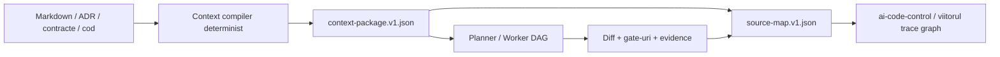

# Plan de implementare — ICM selectiv pentru Infoapex AI

Status: **core implementation and deterministic internal pilot complete; common provider-live pilot pending**  
Repository baseline: `92f79b6535da79a0a81695899f98b59ca3869bd8`  
Model baseline: `gpt-5.6-sol`  
Reasoning baseline: `high`  
Plan dependent: [GRAPH-ENGINEERING-IMPLEMENTATION-PLAN.md](GRAPH-ENGINEERING-IMPLEMENTATION-PLAN.md)

## 1. Decizia

Infoapex AI nu va implementa ICM ca limbaj, framework sau nouă sursă de adevăr. Va prelua numai mecanismele care completează arhitectura existentă:

1. un `context-package` determinist, validat, bugetat și hash-uit;
2. identificatori de trasabilitate păstrați end-to-end;
3. semantic source maps bazate pe relații observabile, fără atribuirea automată a cauzalității;
4. invalidare incrementală când se schimbă o intrare declarată și hash-uită;
5. glass-box enforcement prin contracte JSON și evidence, cu Markdown ca vedere umană.

Nu se schimbă structura repository-urilor și nu se introduce un runtime ICM separat.



## 2. Obiective măsurabile

Planul este reușit numai dacă:

- toate `criterionId`, `gateId` și `evidenceContract` ajung din planner în worker fără pierdere;
- fiecare invocare eligibilă poate indica exact context package-ul consumat;
- același set canonic de intrări produce același `contextDigest`;
- schimbarea unei intrări declarate invalidează numai taskurile afectate și descendenții lor;
- schimbarea unui document nefolosit de task nu produce rerulare;
- nicio sursă `proposed` sau advisory nu poate deveni regulă de enforcement;
- raportul final poate lega criteriul, taskul, diff-ul, gate-ul și evidence-ul;
- pilotul nu reduce first-pass gate rate și produce o reducere măsurabilă de context sau rerulări.

## 3. Non-obiective

- compilarea limbajului natural într-o ontologie generală;
- GraphRAG, embeddings sau o bază de date de graf;
- inferarea automată a relației `caused`;
- reconstruirea workerului sau a DAG schedulerului;
- folosirea Obsidian ca sursă de context pentru worker;
- optimizarea pentru un alt model sau alt reasoning effort în timpul baseline-ului inițial.

## 4. Fundația comună de măsurare — ICM-00

Implementation status: **complete on working tree; validation passed 2026-08-28
(351/351 worker tests and 67 JSON files).**

Prioritate: **P0 / blocantă pentru ambele planuri**  
Owner: `ai-code-worker`  
Agent recomandat: un singur `gpt-5.6-sol/high`, urmat de review independent într-o sesiune nouă. Fără agenți paraleli în timpul calibrării.

### Problemă curentă

Estimatorul existent învață din checkpoint-uri `kind:risk`, dar:

- repository-ul Infoapex AI are momentan `0` task samples în istoricul său local;
- checkpoint-ul nu păstrează modelul și reasoning effort-ul;
- estimatorul nu poate separa `gpt-5.6-sol/high` de Luna, Ultra sau alte configurații;
- nu există încă un raport explicit predicted-versus-actual;
- checkpoint-urile sunt create de runtime-ul workerului, nu și de agentul care dezvoltă workerul.

### Livrabile

1. Contract `usage-checkpoint` v1.1 compatibil la citire cu v1.0, cu:
   - `model`;
   - `reasoningEffort`;
   - `modelContextWindow`;
   - `rateLimitWindowMinutes`;
   - `rateLimitResetsAt` când este disponibil;
   - `calibrationProfileId`;
   - predicția low/median/high asociată checkpoint-ului de start.
2. Cheie de bucketing:
   - `engine:model:reasoningEffort:kind:risk`;
   - fallback ierarhic numai cu confidence explicit, niciodată ca estimare exactă.
3. Comandă read-only pentru dezvoltarea repository-ului, de forma:

   ```text
   ai-code-worker benchmark checkpoint --stage ICM-01 --phase start --engine codex
   ai-code-worker benchmark checkpoint --stage ICM-01 --phase end --engine codex
   ```

   Comanda citește numai valorile numerice derivate din ultimul rollout Codex și nu persistă transcriptul.
4. Comandă `benchmark drift` care produce JSON și raport uman:
   - eroare semnată și absolută față de mediană;
   - dacă valoarea reală se află în intervalul estimat;
   - MAPE per profil;
   - drift tokens-per-percentage-point;
   - segmente contaminate de reset, alt model, alt effort sau sesiuni paralele.
5. Teste cu fixtures; niciun test nu pornește un provider real.

### Criterii de acceptare

- înregistrările v1.0 existente continuă să fie citite;
- modelul/effort-ul necunoscut rămâne `null`, nu este inventat;
- cached input nu este numărat de două ori;
- un reset al ferestrei de usage face segmentul `NOT_COMPARABLE`, nu produce o rată falsă;
- raw transcript content nu intră în artifacts;
- testele estimatorului demonstrează că Sol/high și Luna/high nu ajung în același bucket.

## 5. Etapele ICM

### ICM-01 — Închiderea pierderii planner → worker

Implementation status: **complete on working tree; planner 35/35 and worker 356/356
tests passed, including v1.1 fake-run evidence round-trip.**

Prioritate: **P0**  
Depinde de: ICM-00 pentru măsurare, dar contract design poate începe în aceeași sesiune după checkpoint-ul de start.

Livrabile:

- versiune de contract worker care păstrează `criterionId`, `gateId` și `evidenceContract`;
- proiecție planner fără `lostFields` pentru aceste câmpuri;
- validare pentru ID-uri duplicate, dangling sau neacoperite;
- compatibility path explicit pentru manifestele v1;
- teste de round-trip planner → worker → evidence.

Gate:

- zero pierderi de ID într-un set de fixtures valid;
- fiecare gate obligatoriu poate indica criteriul verificat;
- exportul v1 vechi rămâne funcțional sau este respins cu un mesaj de migrare determinist, conform deciziei ADR.

### ICM-02 — Contractul `context-package.v1`

Implementation status: **complete on working tree; AI Code Control 65/65 tests and
the strict JSON Schema example validation passed on 2026-08-28.**

Prioritate: **P0**  
Depinde de: ICM-01.

Contract minimal:

```text
schemaVersion
packageId
runId / taskId
manifestSha256
compilerVersion
sources[]
  sourceId
  sourceType
  canonicalRef
  sourceHash
  sourceCommit
  authority
  selectionReason
  contentRange optional
budget
  maximumTokens
  estimatedTokens
  omittedSources[]
diagnostics[]
contextDigest
createdAt
```

Reguli:

- `contextDigest` se calculează peste o serializare canonică, fără timestamp;
- `createdAt` și căile locale volatile nu modifică digestul semantic;
- conținutul surselor rămâne în fișierele canonice; package-ul conține referințe, hash-uri și numai fragmentele efectiv randate când politica permite;
- `authority` separă `canonical`, `advisory`, `proposed` și `generated`;
- bugetul primar este în tokeni; numărul de caractere rămâne doar fallback explicit;
- eliminarea din buget este deterministă și raportată, nu truncare tăcută.

Measured result for the preregistered `gpt-5.6-sol/high` profile:

```text
preregistered prediction: 2.8M / 3.8M / 4.8M
actual same-session:       3,602,898 total reported tokens
error versus median:       -5.19%
range hit:                 true
token prediction:          GREEN
usage mapping:             COMPARABLE (17 pp, 211,935 tokens/pp)
parallel sessions:         0 detected
```

This is the first clean stage suitable for usage mapping. It is evidence for the
current contract-sized task bucket, not yet a recalibration: the plan still requires
at least three clean comparable segments before fitting a new profile.

### ICM-03 — Compiler determinist și integrarea cu workerul

Prioritate: **P0**  
Depinde de: ICM-02.

Livrabile:

- compiler în `ai-code-control` sau într-un boundary package fără dependență inversă către worker;
- selecție bazată pe task, `relevantSymbols`, contract IDs și reguli declarate;
- adapterul worker consumă package-ul prin CLI/JSON contract;
- fallback la context provider curent când feature flag-ul este dezactivat;
- promptul agentului este randat numai din package-ul validat;
- `context-package` și source map sunt exportate în directorul runului, cu redacție.

Feature flag recomandat:

```text
contextPackage.mode = off | observe | enforce
```

- `off`: comportament existent;
- `observe`: construiește și compară package-ul, dar nu schimbă promptul;
- `enforce`: workerul folosește package-ul validat.

Rezultat ICM-03 (2026-08-28): **implementat și validat**.

- compilerul determinist și comanda `context-compile` sunt în `ai-code-control`;
- workerul validează independent schema și digestul și exportă package-ul plus indexul;
- modurile `off`, `observe` și fail-closed `enforce` sunt implementate;
- Codex și Claude primesc package-ul validat în prompt și emit evenimentul de consum;
- testele sunt verzi: control 69/69, planner 35/35, worker 368/368;
- actualul măsurat a fost 15,460,481 tokeni față de 3.0M / 4.1M / 5.2M estimat:
  **RED**, +277.08% față de mediană;
- usage procentual este `NOT_COMPARABLE` deoarece fereastra s-a resetat de la 44% la
  0%; nu au fost detectate sesiuni paralele.

### ICM-04 — Digest semantic și invalidare incrementală

Prioritate: **P1**, dar obligatorie înainte de pilotul cu enforcement  
Depinde de: ICM-03.

Extinde task input snapshot cu:

```text
contextDigest
contractHashes
qualityGateConfigHash
policyHash
toolchainConfigHash
```

Reguli de invalidare:

- modificarea codului unei dependențe invalidează descendenții, ca în prezent;
- modificarea unei surse din context package invalidează taskul consumator;
- modificarea unei surse neincluse nu invalidează taskul;
- modificarea ordinii surselor fără schimbarea conținutului canonic nu schimbă digestul;
- schimbarea compilerVersion produce invalidare explicită;
- semantic equivalence nu este ghicită de LLM; relevanța vine din dependențe declarate.

Rezultat ICM-04 (2026-08-28): **implementat și validat**.

- `task-input-snapshot` v1.1 conține toate digesturile preregistrate și versiunea
  compilerului;
- plannerul incremental separă invalidările directe, taskurile reutilizabile și
  descendenții condiționați de schimbarea commitului;
- sursele neincluse, ordinea surselor și metadatele de instanță nu invalidează taskul;
- CLI-ul blochează reutilizarea unui run înghețat când detectează drift semantic și
  cere graph revision nouă;
- testele sunt verzi: control 69/69, planner 35/35, worker 375/375;
- actualul măsurat a fost 5,950,368 tokeni față de 2.5M / 3.5M / 4.5M estimat:
  **RED**, +70.01% față de mediană;
- usage mapping este `COMPARABLE`: 22 pp și 270,471 tokeni/pp, fără sesiuni paralele.

### ICM-05 — Semantic source map și glass-box enforcement

Prioritate: **P1**  
Depinde de: ICM-01, ICM-03.

Artefact `source-map.v1.json`:

```text
rule/ADR/contract -> criterion -> task -> file/symbol -> gate -> evidence
```

Se înregistrează relații observabile precum:

- `selected_for`;
- `requires`;
- `implemented_by`;
- `changed_by`;
- `verified_by`;
- `derived_from`.

Nu se înregistrează automat `caused`. Relațiile inferate de model sunt advisory și au evidence/confidence separat.

Enforcement:

- manifestul și schemele rămân autoritatea mașinii;
- Markdown rămâne autoritatea umană numai în ordinea source-of-truth declarată;
- o regulă `proposed` nu poate autoriza, bloca sau trece un gate;
- fiecare verdict PASS are evidence verificabil și identificatori stabili;
- orice ID pierdut la boundary este eroare de contract.

Rezultat ICM-05 (2026-08-28): **implementat și validat**.

- runurile traceable v1.1 generează `source-map.v1.json` înainte de DONE;
- schema permite numai relațiile declarate/observate preregistrate și exclude `caused`;
- ID-urile criterion/gate trebuie să ajungă intacte în evidence, iar fiecare criteriu
  PASS necesită o comandă legată cu exit code zero;
- sursele `proposed` nu pot participa la `verified_by` și nu pot autoriza verdictul;
- testele sunt verzi: control 69/69, planner 35/35, worker 379/379;
- actualul măsurat a fost 7,185,518 tokeni față de 1.8M / 2.5M / 3.2M estimat:
  **RED**, +187.42% față de mediană;
- usage mapping este `COMPARABLE`: 24 pp și 299,397 tokeni/pp, fără sesiuni paralele;
- cele trei sample-uri curate ICM-02/04/05 au mediana 270,471 tokeni/pp și pot defini
  numai un profil prospectiv pentru Graph Engineering.

### ICM-06 — Pilot, migrare și release gate

Prioritate: **P0 pentru declararea funcției ca livrată**  
Depinde de: toate etapele anterioare.

Pilot recomandat:

- 20 de taskuri comparabile;
- minimum 5 taskuri cu modificări de contract;
- minimum 5 taskuri cu cod + teste;
- minimum 5 taskuri de documentație/review;
- minimum 5 taskuri care schimbă o intrare și verifică invalidarea;
- Un proiect consumator extern poate fi pilot, dar benchmark-ul Infoapex trebuie să aibă și fixtures generice.

Metrici:

- total reported tokens, separat uncached/cache-read/output;
- usage percentage din aceeași fereastră de 300 minute, numai pentru segmente curate;
- first-pass gate rate;
- rerun count;
- retry/repair count;
- context package size;
- procentul criteriilor cu trace complet;
- timp până la explicarea unui verdict greșit.

Praguri de acceptare propuse:

- `100%` ID trace coverage pentru taskurile pilot;
- minimum `90%` dintre criterii au evidence direct;
- nicio scădere a first-pass gate rate mai mare de 5 puncte procentuale;
- minimum `15%` reducere în input uncached sau rerulări, fără regresie funcțională;
- MAPE al estimatorului sub `20%` după minimum 5 samples per bucket sau rezultat `INSUFFICIENT_HISTORY`;
- minimum `80%` dintre valorile reale se află în intervalul low–high preregistrat.

Rezultat intern la 2026-08-28:

- matricea deterministă a rulat `20/20` taskuri: 5 contract, 5 cod + teste,
  5 documentație/review și 5 invalidare semantică;
- trace coverage, direct evidence și first-pass gate rate au fost `100%`;
- cele 5 controale de invalidare au confirmat atât reutilizarea intrărilor neschimbate,
  cât și motivul unic `POLICY_CHANGED` după modificarea politicii;
- root build/test, worker `379/379`, planner `35/35`, control `69/69`, review gate,
  docs gate, generic-boundary, scope verification și validation runner au trecut;
- verdictul automat este `INTERNAL_PASS_LIVE_REQUIRED`: pilotul live nu a fost pornit
  deoarece ar consuma un provider extern și necesită autorizare separată;
- actualul ICM-06 a fost `3,118,860` tokeni față de `2.5M / 3.4M / 4.5M` estimat:
  `GREEN`, cu o eroare de `-8.27%` față de mediană și range hit;
- usage mapping este comparabil: `14 pp`, aproximativ `222,776 tokeni/pp`.

Raportul final ICM rămâne `RED` la nivel de predicție agregată (`MAPE 174.2%`,
`33.3%` range hits), dar are `4/6` segmente curate pentru mapping. Mediana curată
este `246,623 tokeni/pp`; aceasta devine calibrarea prospectivă pentru Graph
Engineering, fără rescrierea estimărilor ICM preregistrate.

## 6. Ordine, agenți și review

| Ordine | Etapă | Agent principal | Review | Motiv |
|---:|---|---|---|---|
| 1 | ICM-00 | Sol/high, sesiune izolată | Sol/high, sesiune nouă | face măsurarea comparabilă |
| 2 | ICM-01 | Sol/high | review contract independent | închide pierderea reală existentă |
| 3 | ICM-02 | Sol/high | review schema + security | definește boundary-ul stabil |
| 4 | ICM-03 | Sol/high | review integrare | leagă control de worker fără importuri |
| 5 | ICM-04 | Sol/high | review invalidation/recovery | previne rerulări greșite |
| 6 | ICM-05 | Sol/high | review evidence/source-of-truth | activează glass-box real |
| 7 | ICM-06 | Sol/high | verdict determinist + review uman | validează valoarea, nu doar testele |

În prima execuție nu se folosesc agenți paraleli pentru etapele de implementare. Paralelismul ar contamina atribuirea `used_percent`. Testele deterministe pot rula în paralel deoarece nu consumă provider usage.

## 7. Estimare inițială de tokeni și usage

### Metodă

Estimările sunt pentru **Codex GPT-5.6 Sol/high** și reprezintă `total reported tokens`, inclusiv cached input, nu echivalent de cost API.

Snapshot-ul de calibrare disponibil la redactarea planului:

```text
model: gpt-5.6-sol
reasoning effort: high
window: 300 minute
total reported tokens: 7,272,723
used_percent: 51%
```

Raportul brut este aproximativ `142.6k reported tokens / punct procentual`, dar este un singur sample și poate fi afectat de fereastra rulantă, cache și alte turnuri. Pentru preregistrare folosim intervalul conservator `120k–170k tokens/pp`. Procentele din tabel sunt **puncte procentuale 5h-equivalent cumulate pe segmente curate**, nu procentul care va apărea simultan în UI după mai multe reseturi.

Primul control cu readerul propriu, efectuat pentru redactarea și validarea acestor două planuri, a produs:

```text
PLAN-DESIGN-01 (candidate calibration sample)
start: 7,272,723 total tokens / 51% used
end:   7,905,610 total tokens / 55% used
delta:   632,887 total tokens / +4 pp
ratio:   158.2k tokens/pp
drift față de seed-ul 142.6k: +11.0%
```

Sample-ul este în intervalul preregistrat `120k–170k`, dar nu devine singur baseline authoritative: a fost citit din aceeași sesiune Sol/high și aceeași fereastră de 300 minute, însă trebuie confirmat prin minimum 5 etape fără reset și fără alte sesiuni care consumă același rate-limit.

### Primul rezultat post-implementare — ICM-01

```text
predicție preregistrată: 1.4M / 1.9M / 2.4M
actual same-session:    11,346,130 total reported tokens
eroare față de mediană: +497.2%
range hit:              false
token prediction:       RED
usage mapping:          NOT_COMPARABLE (fereastra de 5h s-a resetat)
parallel sessions:      0 detectate
```

Concluzia corectă este dublă: estimarea de tokeni a fost mult prea mică pentru o etapă
cross-module cu două suite complete și output voluminos, dar acest segment nu poate
recalibra raportul tokeni/punct procentual deoarece fereastra s-a resetat. Predicțiile
originale rămân vizibile ca preregistrare; nu sunt rescrise retroactiv. Următoarele
etape vor păstra intervalele inițiale ca baseline și vor raporta separat actualul, până
când există minimum trei segmente curate comparabile pentru un re-fit.

| Etapă | Low tokens | Probabil | High tokens | Usage estimat low–high | Prioritate |
|---|---:|---:|---:|---:|---|
| ICM-00 measurement foundation | 2.0M | 2.7M | 3.5M | 12–29 pp | P0 |
| ICM-01 trace IDs | 1.4M | 1.9M | 2.4M | 8–20 pp | P0 |
| ICM-02 context contract | 2.8M | 3.8M | 4.8M | 17–40 pp | P0 |
| ICM-03 compiler + worker integration | 3.0M | 4.1M | 5.2M | 18–43 pp | P0 |
| ICM-04 incremental invalidation | 2.5M | 3.5M | 4.5M | 15–38 pp | P1 |
| ICM-05 source map + enforcement | 1.8M | 2.5M | 3.2M | 11–27 pp | P1 |
| ICM-06 pilot + migration | 2.5M | 3.4M | 4.5M | 15–38 pp | P0 release |
| **Total** | **16.0M** | **21.9M** | **28.1M** | **94–234 pp; probabil ~154 pp** | — |

Recomandare operațională: 3 sesiuni de implementare și 1–2 sesiuni de pilot/review, fiecare cu checkpoint start/end și fără altă sesiune Sol/high concurentă pe același plan de usage.

## 8. Protocolul de drift la final

Pentru fiecare etapă:

```text
token_error_pct = (actual_tokens - predicted_median) / predicted_median * 100
absolute_token_error_pct = abs(token_error_pct)
range_hit = predicted_low <= actual_tokens <= predicted_high
observed_tokens_per_pp = actual_tokens / clean_usage_delta_pp
mapping_drift_pct = (observed_tokens_per_pp - calibration_tokens_per_pp)
                    / calibration_tokens_per_pp * 100
```

Clasificare:

- **GREEN**: median absolute error ≤20% și ≥80% range hits;
- **YELLOW**: 20–35% sau 60–79% range hits;
- **RED**: >35% sau <60% range hits;
- **NOT_COMPARABLE (token prediction)**: model/effort/sesiune diferită, sesiuni
  concurente ori contor cumulativ negativ/necunoscut;
- **NOT_COMPARABLE (usage mapping)**: oricare dintre cazurile de mai sus, plus reset
  de fereastră sau usage delta nul/negativ. Resetul nu ascunde eroarea de predicție în
  tokeni când delta cumulativă provine din aceeași sesiune.

La finalul ICM-06 se rulează:

```text
ai-code-worker benchmark drift --plan ICM --profile codex:gpt-5.6-sol:high
```

Raportul devine baseline-ul Graph Engineering. Estimările nu se ajustează retroactiv; o calibrare nouă primește un ID și se aplică numai etapelor viitoare.

## 9. Definition of done

- toate acceptance criteria de mai sus trec;
- schemele și contractele au compatibility tests;
- testele worker, planner, control și root gates trec;
- `npm run value-gate:internal`, review gate și docs gate trec;
- minimum un pilot real bounded produce usage complet;
- drift report este generat și explică sample-urile excluse;
- documentația, ADR-urile și todo-urile sunt sincronizate;
- Graph Engineering poate consuma trace IDs și context/source maps fără adapter privat.
