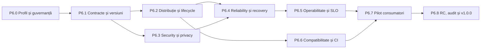

# Infoapex AI — plan P6 Production Readiness & Developer Adoption

Status: **plan aprobat conceptual; implementarea nu a început**  
Data planului: **2026-09-04**  
Țintă: **primul release stabil `v1.0.0`**  
Dependență: nucleul P0–P4.5 închis și profilul minim P5 descris în secțiunea 5  
Principiu: P6 transformă implementarea validată într-un produs instalabil, operabil,
actualizabil și suportabil; nu adaugă capabilități AI doar pentru a mări suprafața produsului.

## 1. Decizie și poziționare

P6 este o etapă separată de P5.

- **P5** evaluează și introduce capabilități avansate în subproiecte independente.
- **P6** stabilește profilul suportat de producție și îi închide ciclul de viață:
  distribuție, upgrade, securitate, recovery, operare, suport și adopție.

`v1.0.0` nu este blocat de toate subproiectele P5. UI-ul local, Draft PR, providerii
suplimentari și agent teams pot rămâne dezactivate sau post-`v1.0.0`. Release-ul este însă
blocat de izolarea reală a execuției, supply-chain verificabil și telemetria redactată.

P6 nu modifică retrospectiv baseline-urile P2, P4.5 sau evidențele candidaților P5.
Orice afirmație de valoare pentru `v1.0.0` folosește un experiment nou, preregistrat.

## 2. Rezultatul urmărit

La ieșirea din P6, un consumator trebuie să poată:

1. instala o versiune identificabilă dintr-un canal documentat;
2. valida mediul și configurația înainte de prima execuție;
3. rula profilul suportat fără `danger-full-access` ca mod implicit;
4. actualiza, migra și reveni la versiunea anterioară fără pierdere de date;
5. înțelege permisiunile, costul estimat, scope-ul și procesele ce vor fi pornite;
6. relua în siguranță o execuție întreruptă;
7. diagnostica un incident cu un support bundle redactat;
8. verifica versiunea, provenance-ul, semnătura și SBOM-ul artefactului;
9. aplica politici de retenție, export și ștergere pentru datele operaționale;
10. primi o promisiune explicită de compatibilitate și suport.

## 3. Non-obiective pentru `v1.0.0`

Prima versiune de producție nu trebuie să:

- suporte orice provider sau orice versiune de CLI/SDK;
- ofere implicit execuție remote, Draft PR sau agent teams;
- includă un serviciu SaaS ori control plane multi-tenant;
- promită disponibilitate pentru provideri terți pe care Infoapex nu îi controlează;
- automatizeze publicarea sau acțiunile externe fără autorizare explicită;
- păstreze transcripturi brute, secrete sau cod sursă în telemetrie;
- garanteze că un agent rezolvă o cerință ambiguă;
- transforme scorul benchmark într-o promisiune universală de productivitate;
- mențină compatibilitate nelimitată cu scheme sau versiuni scoase din suport.

## 4. Profilul minim de producție

Primul profil stabil este `core-local`:

| Suprafață | Angajament `v1.0.0` |
|---|---|
| Mod de rulare | local, într-un repository autorizat explicit |
| Provideri | maximum doi provideri declarați și testați; niciun fallback tăcut |
| Izolare | backend OS/container probat, fail-closed; worktree-ul singur nu este suficient |
| Acțiuni externe | dezactivate implicit |
| UI | opțional; CLI-ul și contractele machine-readable rămân suprafața normativă |
| Telemetrie | local/off implicit pentru export; OpenTelemetry redactat la opt-in |
| Evidence | local, bounded, cu retenție și ștergere configurabile |
| Upgrade | o versiune minoră înapoi și toate patch-urile din linia suportată |
| Platforme | Windows și Linux obligatoriu; macOS obligatoriu înaintea distribuției publice |
| Suport | matrice explicită pentru Node, .NET și adaptoarele providerilor |

Orice profil viitor `team-remote` sau `hosted` primește threat model, SLO și gate-uri
separate. Acceptarea profilului `core-local` nu autorizează automat aceste profiluri.

## 5. Dependențe P5 necesare și opționale

### Obligatorii înainte de `v1.0.0`

- OpenTelemetry redactat — deja acceptat intern; se revalidează în configurația RC.
- Backend de izolare real sau o alternativă locală echivalentă probată.
- Policy signing, provenance de release și SBOM.

### Necesare numai dacă intră în profilul `v1.0.0`

- provider registry și adaptorul fiecărui provider activat;
- SDK adapters, dacă înlocuiesc CLI-urile în profilul stabil;
- backend remote, dacă este promis ca funcționalitate stabilă.

### Neobligatorii pentru primul release stabil

- UI local;
- Draft PR adapter;
- agent teams și `GRAPH-06`;
- provideri suplimentari;
- generarea repetitivă de fixtures/documentație.

## 6. Fluxul de livrare



P6.1–P6.3 pot avea implementări parțial paralele după înghețarea P6.0, dar gate-urile
P6.4–P6.8 rămân secvențiale. Nu se publică un RC dacă o migrare, un control de securitate
sau un recovery test este încă `INCONCLUSIVE`.

## 7. P6.0 — Profil de produs și guvernanță

### Obiectiv

Înghețarea promisiunii făcute consumatorului înaintea modificării installerului sau a
contractelor.

### Livrabile

1. ADR pentru profilul `core-local` și suprafața publică `v1.0.0`.
2. Decizie documentată pentru distribuție:
   - internă;
   - privată pentru clienți;
   - publică.
3. Decizie de licențiere și utilizare a mărcilor; nu se modifică termenii fără owner uman.
4. Politică de versiuni, suport, deprecation și end-of-life.
5. `SECURITY.md`, `CONTRIBUTING.md`, `CHANGELOG.md` și `CODEOWNERS`.
6. Clasificarea datelor: public, intern, sensibil și secret.
7. Registru de riscuri și owner pentru fiecare release gate.
8. Lista funcționalităților explicit excluse din `v1.0.0`.

### Gate de ieșire

- fiecare comandă și contract public are owner și nivel de stabilitate;
- canalul de distribuție și politica de suport nu se contrazic;
- licența permite exact modelul de distribuție ales;
- toate deciziile ce necesită autoritate umană sunt închise, nu presupuse de agent.

## 8. P6.1 — Contracte, compatibilitate și migrare

### Obiectiv

Schimbările de versiune devin previzibile și recuperabile.

### Livrabile

1. Registru unic pentru versiunile schemelor și contractelor root/module.
2. Matrice `producer × consumer` pentru compatibilitatea dintre module.
3. Politică SemVer care definește concret schimbările major/minor/patch.
4. Contract pentru version negotiation la toate granițele dintre procese.
5. Validarea mesajelor la intrare și ieșire, inclusiv exit codes stabile.
6. Framework de migrare pentru configurații, state și bazele SQLite:
   - `preflight`;
   - backup verificat;
   - `dry-run`;
   - migrare idempotentă;
   - verificare post-migrare;
   - rollback sau instrucțiune explicită de restore.
7. Comenzi propuse:

```text
infoapex-ai config validate
infoapex-ai config explain
infoapex-ai migrate --check
infoapex-ai migrate --dry-run
infoapex-ai migrate
```

8. Fixtures cu cel puțin ultima versiune minoră și toate patch-urile suportate.
9. Teste negative pentru schemă viitoare, schemă prea veche și migrare întreruptă.

### Gate de ieșire

- round-trip fără pierderi pentru toate contractele suportate;
- migrarea repetată nu modifică din nou state-ul;
- o întrerupere în fiecare pas al migrării este recuperabilă;
- o versiune incompatibilă e respinsă înainte de pornirea providerului;
- niciun câmp necunoscut nu este șters silențios.

## 9. P6.2 — Distribuție, instalare, upgrade și rollback

### Obiectiv

Eliminarea instalărilor artizanale și transformarea bundle-ului într-un artefact suportabil.

### Livrabile

1. Canal canonic pentru `stable`, `beta` și, dacă este util, `nightly`.
2. Artefacte reproduse din commit curat, cu checksum, provenance, semnătură și SBOM.
3. Testarea artefactului publicabil (`npm pack`, ZIP sau installer), nu doar a sursei.
4. Installer idempotent, non-interactiv în CI și interactiv local.
5. Comenzi propuse:

```text
infoapex-ai install --check
infoapex-ai upgrade --check
infoapex-ai upgrade
infoapex-ai rollback
infoapex-ai uninstall --keep-data
infoapex-ai doctor --production
```

6. Backup automat înainte de upgrade și inventar al fișierelor create.
7. Rollback fără downgrade tăcut al datelor incompatibile.
8. Uninstall care păstrează implicit evidence/state și cere confirmare separată pentru ștergere.
9. Manifest machine-readable cu versiunea root, pinurile modulelor și compatibilitățile.
10. Release notes generate din schimbări revizuite, nu exclusiv din mesaje de commit.

### Gate de ieșire

- clean install trece în toate platformele suportate;
- upgrade și rollback trec pe o matrice `N-1 → N → N-1`;
- instalarea offline nu face download-uri ascunse la runtime;
- artefactul instalat produce același manifest și aceleași hash-uri ca release-ul;
- niciun secret sau fișier local necomis nu poate intra în artefact.

## 10. P6.3 — Security și privacy hardening

### Obiectiv

Definirea și probarea unei limite de securitate pentru întregul produs, nu doar pentru
benchmark.

### Livrabile

1. Threat model root care compune threat model-urile modulelor și profilului de execuție.
2. Politică de disclosure și proces de triere a vulnerabilităților.
3. Subprocess policy cu:
   - allowlist de executabile;
   - argumente validate structural;
   - director de lucru autorizat;
   - timeout și limită de output;
   - environment allowlist;
   - refuzul shell interpolation implicit.
4. Secret handling prin OS keychain/secret manager sau referințe, fără valori persistate în plan.
5. Redactare unică aplicată logurilor, evidence-ului, support bundle-ului și telemetry export.
6. Politică de retenție, export și ștergere verificabilă.
7. Audit events append-only sau tamper-evident pentru autorizări și acțiuni privilegiate.
8. CI security:
   - dependency review și audit;
   - secret scanning;
   - SAST/CodeQL;
   - verificarea licențelor;
   - teste pentru command/path injection și symlink/junction escape.
9. Procedură de rotație și revocare a cheilor de semnare.
10. Review independent pentru toate boundary-urile T0/T1.

### Gate de ieșire

- zero finding critic sau high neacceptat explicit;
- zero secret în toate corpusurile de test și support bundles;
- toate tentativele de scope, symlink/junction și subprocess escape eșuează închis;
- profilul standard nu cere `danger-full-access`;
- telemetria externă este opt-in și nu include conținut brut;
- ștergerea datelor are test end-to-end și dovadă machine-readable.

## 11. P6.4 — Reliability, recovery și controlul resurselor

### Obiectiv

Execuțiile întrerupte sau concurente nu pierd state, nu dublează efecte și nu ies din scope.

### Livrabile

1. Model de stare și invariants pentru fiecare tranziție `plan → run → review → docs`.
2. Atomic writes și tranzacții pentru manifest, events și state critic.
3. Lock/lease cu detectarea proceselor abandonate și recovery determinist.
4. Idempotency keys pentru taskuri, gate-uri și acțiuni externe.
5. Retry policy diferențiată pentru quota, transient, deterministic și policy failure.
6. Limite configurabile pentru timp, procese, memorie, disk, output și invocări provider.
7. Fault-injection matrix:
   - kill înainte/după fiecare commit de state;
   - provider timeout/disconnect/rate limit;
   - răspuns invalid sau oversized;
   - disk full și permisiuni retrase;
   - worktree corupt;
   - două rulări pe același repository;
   - cleanup întrerupt;
   - migrare întreruptă.
8. Soak test și test de concurență pe durata stabilită în P6.0.
9. Recovery report care explică decizia fără a expune date sensibile.
10. Cleanup explicit și inventar al resurselor rămase după incident.

### Gate de ieșire

- zero dublare de commit, task sau acțiune externă în testele de retry;
- state-ul rămâne valid după fiecare punct de întrerupere injectat;
- două execuții conflictuale sunt serializate sau una este respinsă explicit;
- limitele de resurse opresc controlat execuția și păstrează evidence suficient;
- recovery nu lărgește permisiunile și nu schimbă providerul în tăcere.

## 12. P6.5 — Operabilitate, SLO și suport

### Obiectiv

Un operator poate detecta, explica și remedia problemele fără acces la transcripturi brute.

### Livrabile

1. SLI/SLO pentru:
   - finalizare controlată;
   - încălcări de scope;
   - leakage;
   - recovery;
   - latență;
   - consum și intervenții umane.
2. Health/readiness checks pentru root, module, provider și backend de izolare.
3. Dashboard de referință peste OpenTelemetry redactat.
4. Alerte cu severitate, deduplicare și owner.
5. `infoapex-ai diagnostics bundle` cu manifest, health, evenimente redactate și hash-uri.
6. Runbook-uri pentru minimum:
   - provider indisponibil;
   - state/migration failure;
   - sandbox failure;
   - scope/security incident;
   - disk exhaustion;
   - rollback de release.
7. Audit al creșterii volumului de telemetry/evidence și limite de retenție.
8. Politică de suport, severități și timpi țintă de răspuns.
9. Exercițiu de incident și postmortem fără vină, efectuat înainte de RC.

### Praguri inițiale de înghețat în P6.0

- `100%` dintre execuții se termină într-o stare terminală explicită;
- `0` scope escapes și `0` secret leaks;
- minimum `95%` dintre recovery-urile simulate fără intervenție manuală;
- minimum `99%` dintre evenimentele eligibile au trace complet;
- overhead-ul de observabilitate rămâne sub pragul acceptat de experimentul P5 sau un
  prag RC preregistrat mai strict.

Pragurile nu se relaxează după pornirea pilotului. Dacă datele reale arată că sunt greșit
definite, se închide experimentul ca `INCONCLUSIVE` și se creează o versiune nouă.

## 13. P6.6 — Compatibilitate, calitate și CI de release

### Obiectiv

Promisiunea de suport este verificată automat pe mediile declarate.

### Livrabile

1. Matrice CI Windows/Linux și macOS dacă distribuția devine publică.
2. Minimum versiunea runtime recomandată și o versiune compatibilă încă suportată.
3. Matrice pentru versiunile provider CLI/SDK declarate ca suportate.
4. Contract tests între bundle și fiecare modul publicat/pinned.
5. Teste pentru repository TypeScript, .NET și mixt, inclusiv monorepo.
6. Teste property-based/fuzz pentru scheme, căi, quoting și event parsing.
7. Coverage baseline publicat; boundary-urile de securitate au coverage explicit `100%` pe
   scenariile enumerate, fără a folosi procentul global ca substitut pentru calitate.
8. Performance baseline pentru startup, plan, resume, graph query și packaging.
9. Praguri de regresie separate pentru latență, memorie, disk și dimensiunea artefactului.
10. Reproducible release smoke pornit exclusiv din artefactul candidat.

### Gate de ieșire

- matricea suportată este verde fără retry pentru a ascunde flakiness;
- orice combinație nesuportată e detectată de `doctor` înaintea execuției;
- zero regresie critică față de baseline-ul înghețat;
- fiecare defect de compatibilitate găsit în pilot primește regression test.

## 14. P6.7 — Developer Experience și pilot consumator

### Obiectiv

Demonstrarea faptului că produsul poate fi adoptat și operat fără cunoașterea internelor sale.

### Livrabile DX

1. Quickstart verificat, cu timp țintă de maximum 15 minute până la primul run `fake`.
2. Tutorial separat pentru prima execuție live autorizată.
3. Exemple TypeScript, .NET și monorepo.
4. Rețete CI și configurații minimale copiable.
5. Troubleshooting bazat pe coduri de eroare stabile.
6. Ghiduri de upgrade, rollback, backup/restore și incident reporting.
7. Mesaje CLI acționabile, fără stack trace implicit pentru utilizatorul final.
8. Feedback comandabil (`diagnostics bundle`) fără upload automat.

### Protocol pilot

Pilotul se preregistrează înainte de prima rulare și include cel puțin:

- 3 repository-uri consumatoare care nu sunt fixtures Infoapex;
- 2 utilizatori sau echipe independente de implementatorul principal;
- 60 de taskuri reale bounded cumulate;
- minimum 20 de taskuri reprezentative evaluate paired pentru afirmația de valoare;
- minimum 30 de zile calendaristice între primul și ultimul checkpoint operațional;
- cel puțin un upgrade și un rollback efectuat pe state real, sanitizat;
- un incident drill și un restore test;
- feedback structurat despre onboarding, erori și intervenții manuale.

### Praguri de acceptare inițiale

- minimum `90%` taskuri valide finalizate corect sau respinse corect de policy;
- `100%` verificarea scope-ului pentru toate taskurile;
- `0` incidente critice, scope escapes sau secret leaks;
- maximum `20%` taskuri cu intervenție manuală neplanificată;
- `100%` upgrade/rollback/restore scenarios trecute;
- minimum `80%` dintre utilizatori finalizează quickstart fără ajutor direct.

Dimensiunea pilotului și pragurile se îngheață în preregistrare. Un rezultat sub prag nu se
„repară” prin eliminarea post-hoc a taskurilor; produce `REJECT` sau `INCONCLUSIVE` conform
protocolului.

## 15. P6.8 — Release Candidate, audit și GA

### Obiectiv

Un release candidat este promovat numai din dovezi complete și reproductibile.

### Livrabile

1. `v1.0.0-rc.1` construit din commit curat și tag protejat.
2. Evidence index pentru toate gate-urile P6 și dependențele P5 obligatorii.
3. Audit independent de securitate, migration/recovery și supply-chain.
4. Benchmark RC preregistrat față de ultimul baseline stabil.
5. Release notes, breaking changes, known limitations și instrucțiuni de rollback.
6. Verificarea instalării de către un consumator care nu a construit artefactul.
7. Perioadă de stabilizare RC definită în P6.0, fără finding critic/high deschis.
8. Go/no-go semnat de ownerii produsului, securității și operării.
9. Publicarea `v1.0.0`, monitorizare și checkpoint post-release.
10. Plan de hotfix și rollback testat înainte de GA.

### Gate final `v1.0.0`

Release-ul este permis numai dacă:

- toate gate-urile P6.0–P6.7 sunt `PASS`;
- nicio dovadă obligatorie nu este lipsă sau `INCONCLUSIVE`;
- toate artefactele sunt semnate, au checksum, provenance și SBOM verificabile;
- pilotul consumator și benchmark-ul RC sunt finalizate;
- zero finding critic/high neacceptat este deschis;
- rollback-ul RC a fost executat, nu doar documentat;
- profilul suportat poate rula fără permisiuni mai largi decât cele declarate;
- documentația corespunde exact artefactului publicat;
- există owner și runbook pentru primele 30 de zile după GA.

## 16. Release gates machine-readable

P6 va introduce `validation/p6/release-gates.json`, validat prin schemă și proiectat în
Markdown. Fiecare gate conține minimum:

```json
{
  "gateId": "P6-SEC-001",
  "owner": "security",
  "status": "PENDING",
  "requiredFor": ["core-local", "v1.0.0"],
  "evidence": [],
  "verifiedCommit": null,
  "expiresAt": null,
  "exception": null
}
```

Stările permise sunt `PENDING`, `PASS`, `FAIL`, `INCONCLUSIVE` și `WAIVED`. `WAIVED` cere
owner uman, motiv, impact, compensating controls și expirare; nu este permis pentru scope
escape, secret leak, semnătură invalidă sau recovery distructiv.

## 17. Teste obligatorii transversale

| Suprafață | Teste minime |
|---|---|
| Contracte | round-trip, forward/backward compatibility, unknown fields, version negotiation |
| Migrare | dry-run, backup, idempotence, interruption, restore, disk full |
| Installer | clean/offline install, upgrade, rollback, uninstall, paths cu spații/Unicode |
| Procese | allowlist, quoting, timeout, output cap, env filtering, child cleanup |
| Filesystem | traversal, symlink/junction, case sensitivity, short paths, permission loss |
| State | atomicity, locking, duplicate events, stale lease, crash recovery |
| Security | secret leakage, injection, tampering, artifact substitution, key revocation |
| Privacy | export opt-in, retention expiry, delete, diagnostics redaction |
| Provider | quota, rate limit, unavailable, malformed output, version unsupported |
| Operare | health, alerts, support bundle, incident drill, rollback drill |
| Release | reproducibility, signature, provenance, SBOM, clean artifact smoke |

## 18. Evidence și reguli de imuabilitate

- Fiecare subetapă are director propriu sub `validation/p6/`.
- Rapoartele derivă din JSON canonic; Markdown nu este sursa de adevăr.
- Evidence-ul include commitul, versiunile, configurația redactată și hash-urile inputurilor.
- Datele necunoscute rămân `null`, nu sunt transformate în zero sau `PASS`.
- Un rerun primește alt `runId`; nu suprascrie rezultatul anterior.
- Excepțiile și waiver-ele sunt versionate și expiră.
- Datele live private rămân în state root local; repository-ul primește numai sumarul redactat.
- Niciun gate nu acceptă exclusiv autoraportarea agentului care a produs schimbarea.

## 19. Strategie de branch și release

1. Fiecare subetapă P6 se implementează în schimbări bounded și reviewabile.
2. Fixurile unui modul standalone se publică mai întâi în repository-ul canonic al modulului.
3. Bundle-ul actualizează pinul numai după CI standalone verde.
4. `main` rămâne integrabil; experimentele live nu modifică retroactiv artefactele.
5. Tag-urile RC și GA sunt protejate și generate numai de workflow-ul de release.
6. Hotfixurile intră în modulul owner, apoi sunt repinned în bundle.
7. Nu se mențin două implementări divergente ale aceleiași funcționalități în bundle și standalone.

## 20. Modele, efort și estimare inițială

Estimările sunt intervale de planificare, nu bugete garantate. După fiecare subetapă se
înregistrează consumul real, abaterea față de mediană și cauza drift-ului.

| Subetapă | Model principal | Efort | Estimare tokeni | Motiv |
|---|---|---:|---:|---|
| P6.0 profil/guvernanță | Sol | high | 1.0M–1.8M | decizii de produs, licență și limite publice |
| P6.1 contracte/migrare | Sol design, Terra implementare | high | 3.5M–6.0M | compatibilitate și state persistent |
| P6.2 distribuție/lifecycle | Terra, Sol review | high | 3.5M–5.5M | packaging și matrice mecanică, cu review supply-chain |
| P6.3 security/privacy | Sol | xhigh | 5.0M–8.0M | boundary-uri, threat model și negative security |
| P6.4 reliability/recovery | Sol design, Terra harness | high | 4.5M–7.5M | invariants și fault injection extins |
| P6.5 operabilitate/SLO | Terra, Sol review | high | 3.0M–5.0M | integrare OTEL, diagnostic și runbooks |
| P6.6 compatibilitate/CI | Terra | high | 3.0M–5.0M | matrice repetitivă și regression harness |
| P6.7 DX/pilot | Terra docs, Sol protocol | high | 3.0M–5.5M plus usage live | documentație și experiment real |
| P6.8 RC/audit/GA | Sol | xhigh | 2.5M–4.5M | verdict final, securitate și release |
| **Total orientativ** | — | — | **29.0M–48.8M plus usage live** | se recalibrează după fiecare subetapă |

Luna poate fi folosit pentru fixtures, matrice de documentație și actualizări repetitive doar
după înghețarea contractelor. Review-ul final al fiecărei subetape rămâne Sol `high` sau
`xhigh` pentru security/release.

### Regula de drift

Pentru fiecare subetapă se păstrează:

```text
estimateLow / estimateMedian / estimateHigh
actualTokens
driftVsMedianPercent
elapsedTime
reworkTokens
driftCause
calibrationForNextStage
```

- `GREEN`: abatere de maximum ±20% față de mediană;
- `AMBER`: abatere între 20% și 40%; se explică și se recalibrează următoarea etapă;
- `RED`: peste 40%; subetapa următoare nu pornește până la revizuirea ipotezelor.

Usage-ul providerilor din pilot se raportează separat de tokenii folosiți pentru implementare.

## 21. Riscuri principale și mitigări

| Risc | Impact | Mitigare |
|---|---|---|
| P6 devine o listă infinită de hardening | amânarea permanentă a release-ului | profil `core-local` și non-obiective înghețate |
| Dublarea P5 | ownership ambiguu | matricea din secțiunea 5 și ADR per boundary |
| Migrare ireversibilă | pierdere de state/evidence | backup, dry-run, interruption și restore gates |
| Permisiuni prea largi | incident de securitate | sandbox probat, allowlist și fail-closed |
| Telemetrie sensibilă | leakage/confidențialitate | redactare unică, opt-in export, retention/delete |
| Provider drift | comportament nereproductibil | matrice de versiuni, capability test și pinning |
| Pilot prea favorabil | afirmații de valoare false | consumatori externi implementatorului și preregistrare |
| Supply-chain compromis | artefact malițios | build reproducibil, semnare, provenance, SBOM |
| Prea multe platforme la v1 | cost operațional excesiv | suport limitat și explicit; extensie după date reale |
| Waiver permanent | degradarea gate-urilor | expirare obligatorie și categorii non-waivable |

## 22. Definition of Done P6

P6 este închis numai când:

1. profilul `core-local` și canalul de distribuție sunt aprobate;
2. instalarea, upgrade-ul, migrarea, rollback-ul și uninstall-ul sunt verificate;
3. politica de securitate, threat model-ul și privacy lifecycle sunt publicate;
4. profilul implicit nu cere acces nerestricționat;
5. fault injection, soak și recovery gates trec;
6. SLO-urile, alertele, runbook-urile și support bundle-ul sunt operaționale;
7. matricea platformă/runtime/provider suportată este verde;
8. pilotul consumator îndeplinește pragurile preregistrate;
9. auditul independent și benchmark-ul RC sunt închise;
10. artefactul `v1.0.0` este reproductibil, semnat și are provenance/SBOM;
11. rollback-ul release-ului a fost demonstrat;
12. toate limitele cunoscute rămase sunt explicite în release notes.

Finalizarea tuturor subproiectelor P5 nu este o condiție pentru închiderea P6. Orice
funcționalitate neacceptată rămâne dezactivată și nu apare în profilul stabil.

